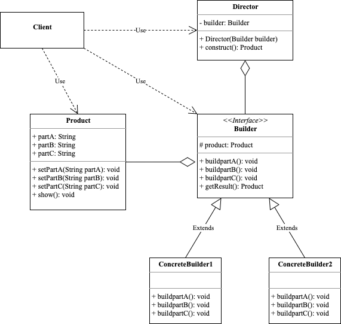

## 建造者模式(Builder Pattern)

> 将一个复杂对象的构建与它的表示分离。使统一的构建过程可以创建不同的表示。
>
> 它将一个复杂的对象分解为多个简单的对象，然后一步一步构建而成，它将变与不变相分离，即产品的组成部分是不变的，但每一部分是可以灵活选择的。

### **角色**

- Product：产品角色

  包含多个组成部分的复杂对象，由具体建造者来创建各个零部件。 

- Builder：抽象建造者

  包含创建产品各个子部件的抽象方法的接口，通常还包含一个返回复杂产品的方法getResult()。

- Concrete Builder：具体建造者

  实现Builder接口，完成复杂产品的各个部件的具体创建方法。

- Director：指挥者

  调用建造者对象中的部件构建与装配方法完成复杂对象的创建，在指挥者中不涉及具体产品的信息。

### **优点**

- 封装性好，构建和表示分离。
- 扩展性好，各个具体的建造者相互独立，有利于系统的解耦。
- 客户端不必知道产品内部组成的细节，建造者可以对创建过程逐步细化，而不对其他模块产生任何影响，便于控制细节风险。

### **缺点**

- 产品的组成部分必须相同，这限制了其使用范围。
- 如果产品的内部变化复杂，如果产品内部发生变化，则建造者也要同步修改，后期维护成本较大。

> 建造者模式和工厂模式的关注点不同：建造者模式注重零部件的组装过程，而工厂方法模式更注重零部件的创建过程，两者可以结合使用。

### **应用场景**

客厅装修是一个复杂的过程，包含：墙体的装修、电视机的选择、沙发的购买与布局等。客户把装修要求告诉项目经理，项目经理指挥工人一步步装修，最后完成整个客厅的装修与布局。

  

  

  