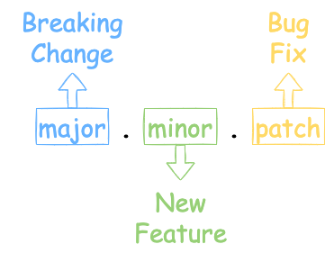

::: tip
随着系统功能越来越复杂，依赖的软件包越来越多，如何解决【依赖地狱】问题？
:::

<!-- more -->

## 语义化版本规范
>语义化版本规范（SemVer,Semantic Versioning）是Github起草的一个具有指导意义的、统一的版本号表示规范。
>它规定了版本号的表示、增加和比较方式，以及不同版本号代表的含义。

语义化版本格式为：`主版本号.次版本号.修订号（X.Y.Z）`，其中X、Y和Z为非负整数，且禁止在数字前方补零。
例如：v1.2.3

版本号增加的含义：
- 主版本号（MAJOR）：当做了不兼容的API修改。一般用于大的功能变动(Breaking Change)，影响到之前的功能。
- 次版本号（MINOR）：当做了向下兼容的功能性新增及修改。一般用于不影响之前逻辑的功能优化，或者新的功能(New Feature)。
- 修订号（PATCH）：当做了向下兼容的问题修正，一般用于问题修复(Bug Fix)。

一些经验：
- 建议0.1.0作为第一个开发版本号；
- 当用于正式环境，它应该达到1.0.0版，0.y.z版本均可视为不稳定版本，仍在持续开发中；
- v1.2.3并不是一个语义化的版本号，但是在语义化版本之前增加前缀”v"是用来表示版本号的常用做法；

关于语义化版本规范详细内容参考：[semver.org](https://semver.org/lang/zh-CN/)

## 先行版本
此外我们还会经常遇见先行版本，例如：1.0.0-alpha.0、1.0.0-alpha.1、1.0.0-beta.0、1.0.0-rc.0、1.0.0-rc.1等
>当要发布大版本或者核心的feature时，但又不能保证这个版本的功能100%正常，这个时候就需要通过发布先行版本

常见的先行版本包括：内测版 、灰度版和RC版本。Semver规范中使用alpha、beta、rc来修饰即将要发布的版本。
- alpha:内部版本，该版本表示软件在此阶段主要是以实现功能为主，用于软件开发内部交流，一般bug比较多；
- beta:公测版本，该版本表示相对alpha版已经改进，但仍然存在一些缺陷，需要各个方面测试；
- rc:即release candiate，正式版本的候选版本，该版本已经相当成熟，基本上不存在问题；

## 工具
另外可以使用一些工具规范版本号：
- [gsemver](https://github.com/arnaud-deprez/gsemver)
  - 使用`gsemver bump`命令就可以根据Git历史提交约定生成下一个版本
- [cz-cli](https://github.com/commitizen/cz-cli)