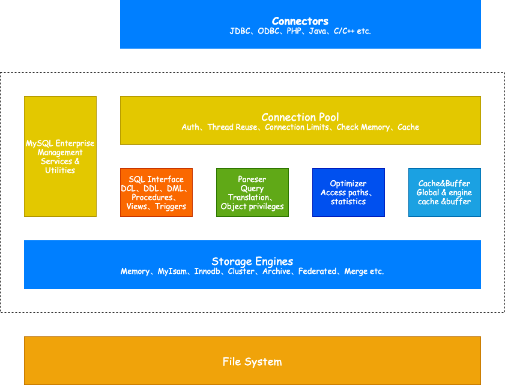

<!-- more -->

> MySQL是常用的关系型数据库

## MySQL架构

## 存储引擎

- 存储引擎是MySQL区别于其他数据库的一个重要特性，MySQL有诸多存储引擎，且**存储引擎是基于表的，而不是数据**(同一个数据库下面的各个表可以使用不同的引擎)
- 存储引擎是底层物理结构的实现，每个存储引擎开发者可以按照自己的意愿开发，具有各自的特点
- 对于MySQL使用者来说，存储引擎对其实透明的

## 引擎对比

| 存储引擎  |                             特点                              |       应用场景       |
| :-------: | :-----------------------------------------------------------: | :------------------: |
|  InnoDB   |       支持事务、行锁、支持MVCC多版本并发控制、并发性高        |         OLTP         |
|  MyISAM   |             不支持事务、表锁、并发低、资源利用低              | 不建议在生产环境使用 |
|  Memory   |       数据存放在内存中、支持Hash和Btree索引、读取速度快       |        临时表        |
|  Archive  | 高度压缩、zlib无损数据压缩，较MyISAM8倍，不支持更新、删除索引 |       海量存储       |
| Blackhole |                 不存储数据，同步时只写binlog                  |    用于binlog转储    |
|    CSV    |    以普通的平面文件作为表文件，提供类似Oracle外部表的功能     |      导入、导出      |
|    NDB    |            集群存储引擎，提供类似Oracle RAC的架构             |       集群存储       |
|  MyRocks  |                     压缩效率高、写性能好                      |   写入压力大，降本   |
