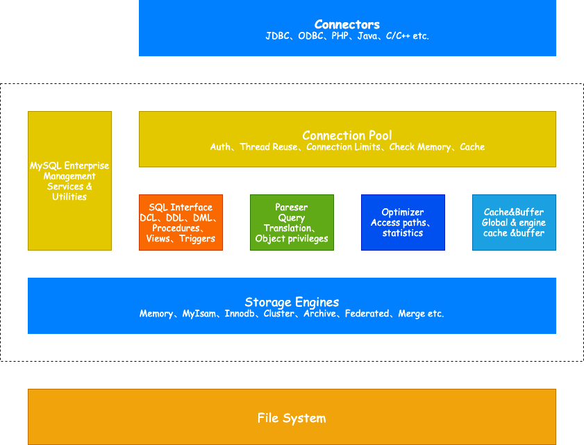

<!-- more -->

[[toc]]

> MySQL是常用的关系型数据库

## MySQL架构

## 存储引擎

- 存储引擎是MySQL区别于其他数据库的一个重要特性，MySQL有诸多存储引擎，且**存储引擎是基于表的，而不是数据**(同一个数据库下面的各个表可以使用不同的引擎)
- 存储引擎是底层物理结构的实现，每个存储引擎开发者可以按照自己的意愿开发，具有各自的特点
- 对于MySQL使用者来说，存储引擎对其实透明的

### Innodb引擎

> 是一个支持ACID事务，行锁设计，支持MVCC功能，实现了SQL标准的4种隔离级别

#### 特点

- 使用Table Space的方式仅限数据存储
- 支持事务、外键约束等数据库特性
- Rows Level Lock，读写性能都非常优秀
- 拥有独立的缓冲池，能够缓存数据和索引
- 通过多版本控制，支持高并发业务

#### 注意事项

- 主键尽可能小，否则二级索引会膨胀
- 避免全表扫描，导致锁升级
- 尽可能缓存所有的索引和数据，减少IO操作
- 避免主键更新，造成大量的数据移动

### MyISAM存储引擎

> MySQL 5.5之前默认是MyISAM存储引擎，之后默认都改为InnoDB

#### 特点

- 数据存储方式简单，使用B-Tree进行索引，**索引叶子节点存放数据的指针**
- **不支持一些数据库特性，比如事务、外键约束等**
- **Table Level Lock(表级别锁)**，性能稍差，更适合读多的操作
- 使用三个文件定义一个表：
  - `.MYi`：存储索引
  - `.MYD`：存储数据
  - `.frm`：存储表定义
- 少碎片、支持大文件、能够进行索引压缩
- 二进制层次的文件可以移植（Linux->Windows）
- 访问速度快，适合只读查询场景

#### 注意事项

- 设置合适索引
- 启用延迟写入，尽量一次大批量写入，而非频繁写入
- 降低并发数，高并发使用排队机制
- 由于存储了Count字段，因此Count操作比较高效，但仅限不带条件

## 引擎对比

| 存储引擎  |                             特点                              |       应用场景       |
| :-------: | :-----------------------------------------------------------: | :------------------: |
|  InnoDB   |       支持事务、行锁、支持MVCC多版本并发控制、并发性高        |         OLTP         |
|  MyISAM   |             不支持事务、表锁、并发低、资源利用低，但具有高性能和低存储空间消耗的特点              | 适用于大量只读数据的应用场景 |
|  Memory   |       数据存放在内存中、支持Hash和Btree索引、读取速度快       |        用于高并发、无需持久化的应用场景        |
|  Archive  | 高度压缩、zlib无损数据压缩，较MyISAM8倍，不支持更新、删除索引 |       适用于存储大量历史数据       |
| Blackhole |                 不存储数据，同步时只写binlog                  |    用于binlog转储    |
|    CSV    |    CSV格式，数据以文本文件形式存储     |      用于数据交换和数据迁移      |
|    NDB    |            MySQL的分布式存储引擎，支持分布式事务和高可用性，能够处理海量数据             |       集群存储       |
|
