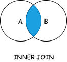
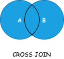
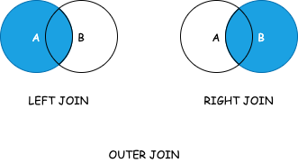

<!-- more -->


> 连接是一种机制，用来在一条SELECT语句中关联表

## 内连接（INNER JOIN）
> 内连接又叫等值连接,它将第一个表中的每一行与第二个表中的每一行配对，只返回匹配给定条件的行
> 从数据的角度就是求两个集合的交集，如下图所示



示例：
```sql
SELECT vend_name,prod_name,prod_price
FROM Vendors
INNER JOIN Products ON Vendors.vend_id = Products.vend_id
```

## 自然连接（NATURE JOIN）
> 自然连接，会自动找出两个表中相同的列作为连接条件进行连接

以下示例语句与内连接语句等价
```sql
SELECT Customers.cust_id,Orders.order_num
FROM Customers
NATURAL JOIN Orders
```


> 也可以省略`INNER`关键字，即`INNER JOIN`和`JOIN`等价

## 叉连接（CROSS JOIN）
> 即返回笛卡尔积的联
> 假设第一个表有6行数据，第二个表中有9行数据，那么通过叉连接就可以返回6*9=54条数据



示例：
```sql
SELECT vend_name,prod_name,prod_price
FROM Vendors
CROSS JOIN Products
```

## 外连接（OUTER JOIN）
> 可以通过内连接将一个表中的行与另一个表中的行相关联，但有时候需要包含没有关联行的那些行，这就需要外连接了。外连接分为：
> - 左外连接，内连接并保留左表没有匹配的行（若SELECT中包含右表的字段，则查询结果对应的记录为NULL）
> - 右外连接，内连接并保留右表没有匹配的行（若SELECT中包含左表的字段，则查询结果对应的记录为NULL）



左外连接示例：
```sql
SELECT Customers.cust_id,Orders.order_num
FROM Customers
LEFT OUTER JOIN Orders ON Customers.cust_id = Orders.cust_id
```
> `OUTER`关键字可以省略，即`LEFT OUTER JOIN`和`LEFT JOIN`等价

右外连接示例：
```sql
SELECT Customers.cust_id,Orders.order_num
FROM Customers
LEFT OUTER JOIN Orders ON Customers.cust_id = Orders.cust_id
```
> `OUTER`关键字可以省略，即`RIGHT OUTER JOIN`和`RIGHT JOIN`等价
