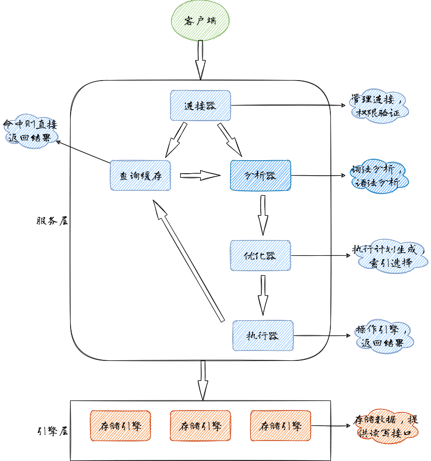
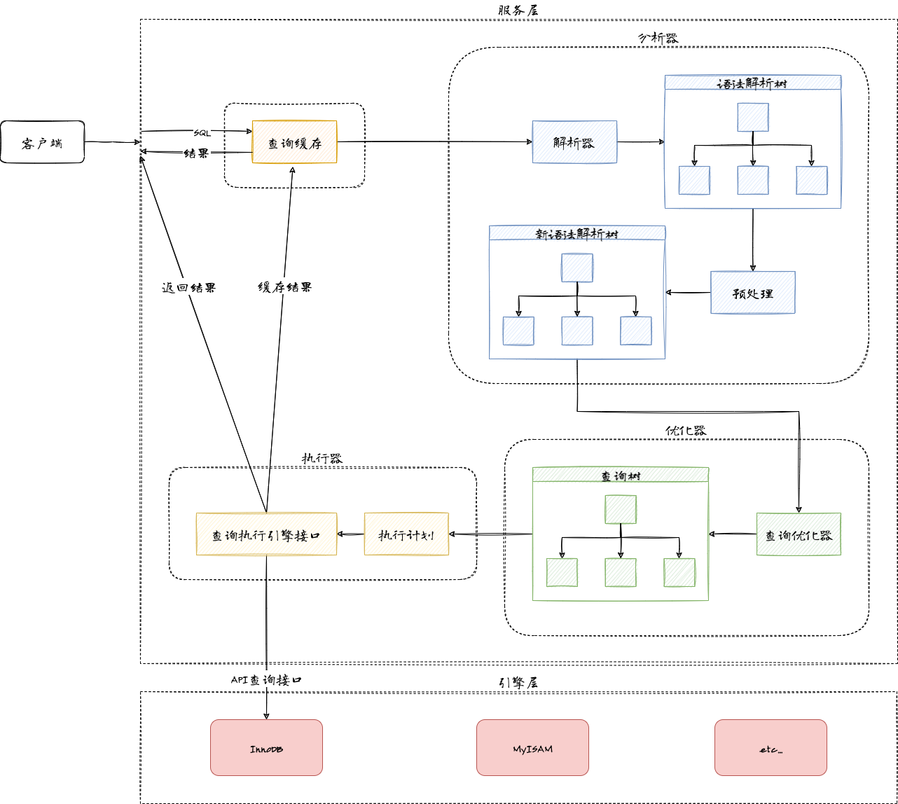

<!-- more -->

## 执行流程

简单的查询过程如下：



详细的查询过程如下：



### 连接器

> 连接器负责跟客户端建立连接、获取权限、维持和管理连接。

我们使用以下命令和MySQL建立连接

```shell
mysql -h$ip -p$port -u$user -P
```

- 如果用户名或密码不对，就会收到一个`Access denied for user`的错误
- 如果用户名密码认证通过，连接器会到权限表里查出当前用户的权限。

我们使用`show processlist`命令可以查看当前建立的连接以及执行的动作

```shell
mysql> show processlist;
+----+-----------------+-----------+------+---------+---------+------------------------+------------------+
| Id | User            | Host      | db   | Command | Time    | State                  | Info             |
+----+-----------------+-----------+------+---------+---------+------------------------+------------------+
|  4 | event_scheduler | localhost | NULL | Daemon  | 2486885 | Waiting on empty queue | NULL             |
| 23 | root            | localhost | NULL | Query   |       0 | starting               | show processlist |
+----+-----------------+-----------+------+---------+---------+------------------------+------------------+
2 rows in set (0.07 sec)
```

### 查询缓存

> `<=MySQL5.7版本`，自带缓存模块，默认关闭；
>
> `>=MySQL5.8版本`，移除缓存模块

MySQL拿到一个查询请求后，会先进行缓存查询，如果之前执行的语句有缓存，则直接返回；

缓存的限制：

- sql语句完全一致
- 表里的数据不发生变化，如果发生变化，这张表的所有缓存都会失效

因此，**不建议使用查询缓存**！

### 分析器

> 分析器对SQL语句进行词法分析、语法分析、语义检查，得到语法树，在这个阶段，输入的是一条SQL语句，输出的是一棵语法树（AST）。

- **词法分析**：从左到右一个字符、一个字符的读入源输入，根据构词规则识别出一条SQL语句里面的字符串分别是什么，代表什么。

- **语法分析**：在词法分析的基础上将单词序列组合成各类语法短语，如：“程序”、“语句”、“表达式”等。判断输入的这个SQL语句是否满足MySQL语法。如果语句不对，就会收到`You have an error in your SQL syntax`的错误提醒。
- **语义检查**：对语法分析树进行逻辑判断，例如：
  - 检查表名是否错误（存在）
  - 检查列名是否错误（存在）
  - 检查别名是否错误（保证没有歧义）

例如：

```sql
SELECT id, name FROM t_user WHERE status = 'ACTIVE' AND age > 18
```

解析为语法树如下：


[参考链接](https://shardingsphere.apache.org/document/current/cn/reference/sharding/parse/)

### 优化器

经过分析器，MySQL知道你需要做什么，在开始执行之前，还需要经过优化器的处理。

例如：优化器在表里面有多个索引的时候，决定使用哪个索引，或者在一个语句有多表关联(join)的时候，决定各个表的连接顺序。

```sql
select * from t1 join t2 using(ID) where t1.c=10 and t2.d=20
```

- 即可以先从表t1里面取出c=10的记录，再根据ID关联到表t2，再判断t2里面的d的值是否等于20
- 也可以先从表t2里面取出d=20的记录，再根据ID关联到表t1，再判断t1里面的c的值是否等于10

这两种执行方案的逻辑一致，但是执行的效率会有不同，优化器会决定选择使用哪一个方案。

#### 逻辑优化

> 优化器在逻辑优化阶段主要解决的问题是：如何找出SQL语句等价的变换形式，使得SQL执行更高效。

#### 物理优化

> 根据数据库的状态统计信息（数据库通过采样，统计出来的表、索引的相关信息，例如：表的记录数、索引的page数量、字段的Cardinality）计算各种操作算法的执行代价，定量的选择最优的查询方式。

### 执行器

> MySQL通过分析器知道了要做什么，通过优化器知道了该怎么做，就会进入执行器阶段，开始执行语句

开始之前，先判断一下用户对表有没有查询的权限，如果没有就会返回没有权限错误，如果有权限，就打开表继续执行，执行器根据表的引擎定义，去使用这个引擎提供的接口。
