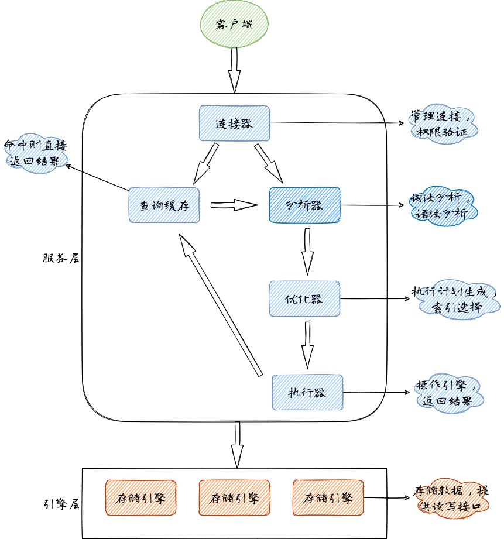
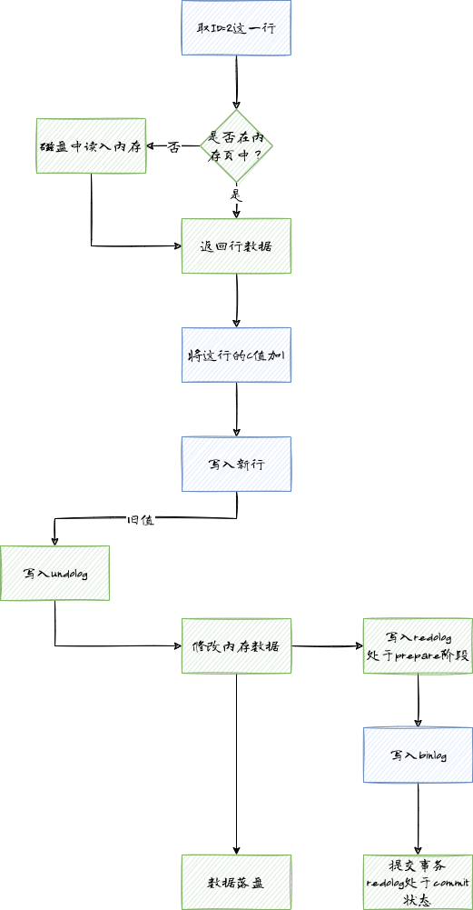

<!-- more -->

## 执行流程

> 查询语句执行的流程，更新语句也会执行类似的过程，稍有差别的地方是更新语句会将更新表的所有缓存清理，这就是为什么不建议使用查询缓存。



### 日志模块

> 更重要的是MySQL的日志模块，这是数据库提供高可用以及事务的重要模块

我们以InnoDB引擎和一条更新语句为例

```sql
update T set c=c+1 where ID=2;
```



- 蓝色框是MySQL服务层处理过程
- 绿色框是InnoDB引擎层处理过程

其中：

- undolog用于InnoDB记录事务回滚日志
- redolog用于InnoDB记录事务前滚日志，保障事务`crash-safe`
- binlog是MySQL服务层归档日志


1. 执行器先找引擎取 ID=2 这一行。ID 是主键，引擎直接用树搜索找到这一行。如果 ID=2 这一行所在的数据页本来就在内存中，就直接返回给执行器；否则，需要先从磁盘读入内存，然后再返回。
2. 执行器拿到引擎给的行数据，把这个值加上 1，比如原来是 N，现在就是 N+1，得到新的一行数据，再调用引擎接口写入这行新数据。
3. 引擎记录undolog
4. 引擎将这行新数据更新到内存中，同时将这个更新操作记录到 redo log 里面，此时 redo log 处于 prepare 状态。然后告知执行器执行完成了，随时可以提交事务。
5. 执行器生成这个操作的 binlog，并把 binlog 写入磁盘。
6. 执行器调用引擎的提交事务接口，引擎把刚刚写入的 redo log 改成提交（commit）状态，更新完成。

redolog的写入拆成了两个步骤：prepare和commit，这就是**两阶段提交**

