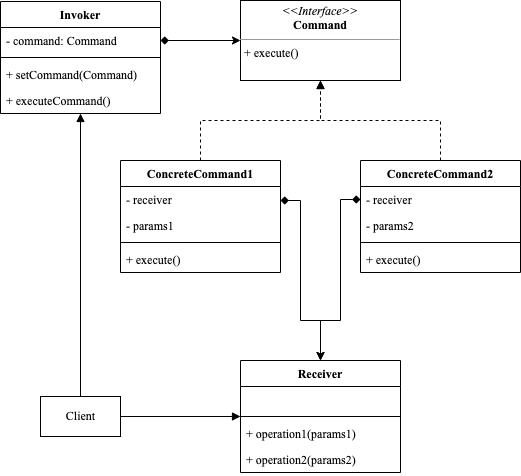

<!-- more -->

[[toc]]

## 什么是行为型模式

命令设计模式允许将请求封装成对象，从而将不同的请求发送者与接收者解耦。命令对象包含了请求的所有信息，包括调用的方法、参数和接收者等。这种方式使得请求的发送者与接收者无需知道彼此的存在，从而可以更灵活地进行交互。

### 包含哪些角色



- Invoker: 调用者
  
  创建和配置命命令对象，并将其传递给接收者

- Command: 命令接口
  
  定义命令的核心接口，通常包括一个执行方法

- ConcreteCommand: 具体命令类

  实现命令接口，并封装具体的操作。通常需要引用接收者，从而调用对应的方法

- Receiver: 接收者

  实现请求的实际操作，命令对象将请求传递给接收者，从而完成请求

### 代码示例

```go
package command

import "fmt"

type Command interface {
	Execute()
}

type Receiver struct{}

func (r *Receiver) operation1(a string) {
	fmt.Println("operation1:", a)
}

func (r *Receiver) operation2(a, b, c string) {
	fmt.Println("operation2:", a, b, c)
}

type Invoker struct {
	cmd Command
}

func (i *Invoker) SetCommand(cmd Command) {
	i.cmd = cmd
}

func (i *Invoker) ExecuteCommand() {
	i.cmd.Execute()
}

type ConcreateCommand1 struct {
	name     string
	receiver *Receiver
}

func (c *ConcreateCommand1) Execute() {
	c.receiver.operation1(c.name)
}

type ConcreateCommand2 struct {
	name     string
	desc     string
	address  string
	receiver *Receiver
}

func (c *ConcreateCommand2) Execute() {
	c.receiver.operation2(c.name, c.desc, c.address)
}
```

使用示例

```go
package command

func ExampleCommand() {
	receiver := Receiver{}
	invoker := Invoker{}

	cmd1 := ConcreateCommand1{name: "admin", receiver: &receiver}
	invoker.SetCommand(&cmd1)
	invoker.ExecuteCommand()

	cmd2 := ConcreateCommand2{name: "admin", desc: "描述", address: "地址", receiver: &receiver}
	invoker.SetCommand(&cmd2)
	invoker.ExecuteCommand()

	// Output:
	// operation1: admin
	// operation2: admin 描述 地址
}
```

## 适用场景

- 需要将请求和执行操作解耦的情况。命令模式可以将请求封装为对象并将其发送给接收者，从而使得发送者和接收者之间松耦合。

- 需要支持撤销或重做操作的情况。由于每个命令都封装了一组特定的操作，因此可以轻松进行撤销或重做。

- 需要支持事务操作的情况。将一组相关的命令组合在一起，可以实现事务操作，即一组操作要么全部成功执行，要么全部失败。

- 需要远程执行操作的情况。将命令对象序列化到网络上，可以实现远程执行操作的功能。

- 需要将命令队列中的请求延迟、调度或者执行的情况。可以将命令对象存储在队列中，然后按照特定的规则执行它们。

- 需要实现日志、审计或者事务记录的情况。可以在执行命令的同时，将其记录下来，并可以将其回放以重现历史操作。

### 请求与执行解耦

```go
package command

type Commander interface {
	Execute()
}

type AddCommand struct {
	receiver *Origin
	value    int
}

func (c *AddCommand) Execute() {
	c.receiver.Add(c.value)
}

type SubtractCommand struct {
	receiver *Origin
	value    int
}

func (c *SubtractCommand) Execute() {
	c.receiver.Subtract(c.value)
}

type MultiplyCommand struct {
	receiver *Origin
	value    int
}

func (c *MultiplyCommand) Execute() {
	c.receiver.Multiply(c.value)
}

type DivideCommand struct {
	receiver *Origin
	value    int
}

func (c *DivideCommand) Execute() {
	c.receiver.Divide(c.value)
}

type Origin struct {
	value int
}

func (r *Origin) Add(value int) {
	r.value += value
}

func (r *Origin) Subtract(value int) {
	r.value -= value
}

func (r *Origin) Multiply(value int) {
	r.value *= value
}

func (r *Origin) Divide(value int) {
	r.value /= value
}

type Computer struct {
	commands []Commander
}

func (i *Computer) AddCommand(command Commander) {
	i.commands = append(i.commands, command)
}

func (i *Computer) ExecuteCommands() {
	for _, command := range i.commands {
		command.Execute()
	}
}
```

使用示例

```
package command

import "fmt"

func ExampleComputer() {
	computer := Computer{}
	origin := Origin{10}
	addCmd := AddCommand{&origin, 20}
	subCmd := SubtractCommand{&origin, 15}
	mulCmd := MultiplyCommand{&origin, 2}
	divCmd := DivideCommand{&origin, 3}
	computer.AddCommand(&addCmd)
	computer.AddCommand(&subCmd)
	computer.AddCommand(&mulCmd)
	computer.AddCommand(&divCmd)
	computer.ExecuteCommands()
	fmt.Println(origin.value)
	// Output:
	// 10
}
```

我们将请求者Computer和接收者Origin，进行了解耦。请求者可以任意追加命令，执行：加、减、乘、除等运算。

### 撤销操作

```go
package command

type Commander interface {
	Execute()
	Undo()
}

type AddCommand struct {
	receiver *Origin
	value    int
}

func (c *AddCommand) Execute() {
	c.receiver.Add(c.value)
}

func (c *AddCommand) Undo() {
	c.receiver.Subtract(c.value)
}

type SubtractCommand struct {
	receiver *Origin
	value    int
}

func (c *SubtractCommand) Execute() {
	c.receiver.Subtract(c.value)
}

func (c *SubtractCommand) Undo() {
	c.receiver.Add(c.value)
}

type MultiplyCommand struct {
	receiver *Origin
	value    int
}

func (c *MultiplyCommand) Execute() {
	c.receiver.Multiply(c.value)
}

func (c *MultiplyCommand) Undo() {
	c.receiver.Divide(c.value)
}

type DivideCommand struct {
	receiver *Origin
	value    int
}

func (c *DivideCommand) Execute() {
	c.receiver.Divide(c.value)
}

func (c *DivideCommand) Undo() {
	c.receiver.Multiply(c.value)
}

type Origin struct {
	value int
}

func (r *Origin) Add(value int) {
	r.value += value
}

func (r *Origin) Subtract(value int) {
	r.value -= value
}

func (r *Origin) Multiply(value int) {
	r.value *= value
}

func (r *Origin) Divide(value int) {
	r.value /= value
}

type Computer struct {
	commands []Commander
}

func (i *Computer) AddCommand(command Commander) {
	i.commands = append(i.commands, command)
}

func (i *Computer) ExecuteCommands() {
	for _, command := range i.commands {
		command.Execute()
	}
}

func (i *Computer) UndoLastCommand() {
	if len(i.commands) > 0 {
		cmd := i.commands[len(i.commands)-1]
		cmd.Undo()
		i.commands = i.commands[0 : len(i.commands)-1]
	}
}
```

使用示例

```go
func ExampleComputerUndo(){
	computer := Computer{}
	origin := Origin{10}
	addCmd := AddCommand{&origin, 20}
	subCmd := SubtractCommand{&origin, 15}
	mulCmd := MultiplyCommand{&origin, 2}
	divCmd := DivideCommand{&origin, 3}
	computer.AddCommand(&addCmd)
	computer.AddCommand(&subCmd)
	computer.AddCommand(&mulCmd)
	computer.AddCommand(&divCmd)
	computer.ExecuteCommands()
	fmt.Println(origin.value)
	computer.UndoLastCommand()
	fmt.Println(origin.value)
	computer.UndoLastCommand()
	fmt.Println(origin.value)
	computer.UndoLastCommand()
	fmt.Println(origin.value)
	// Output:
	// 10
	// 30
  // 15
	// 30
}
```

我们对Commonder接口增加Undo方法，即可以实现计算器的撤销操作。

## 总结

### 优点

- 命令模式可以降低代码的耦合度，并且将请求调用者与请求接收者进行解耦；
- 命令模式扩展性较高
  - 如果是扩展新的命令，那么直接定义新的命令类即可；
  - 如果是执行一组命令，那么

### 缺点

- 可能会导致性能问题。使用命令模式可能会增加对象数量，并且每个命令都需要进行封装，可能会导致性能下降。
- 可能会使代码更加复杂。使用命令模式需要定义许多接口和类，可能会使代码过于复杂，难以维护。
  