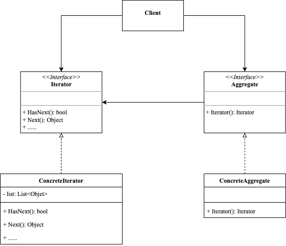

<!-- more -->

[[toc]]

## 什么是迭代器模式

迭代器模式是一种行为设计模式，让你能在不暴露集合底层结构（列表、栈、树等）的情况下遍历集合中的所有元素。

### 包含哪些角色



- Iterator: 迭代器接口
  
  声明了遍历集合所需的操作

- IterableCollection: 集合接口
  
  声明一个方法或多个方法来获取与集合兼容的迭代器。

- ConcreteIterator: 具体迭代器

  实现遍历集合的一种特定算法，迭代器对象必须跟踪自身遍历进度。

- ConcreteCollection: 具体集合
  
  会在客户端请求迭代器时返回一个特定的具体迭代器类实体。

### 代码示例

```go
package iterator

type Aggregate interface {
	Iterator() Iterator
}

type Iterator interface {
	HasNext() bool
	Next() interface{}
}

type ConcreteIterator struct {
	numbers []string
	next    int
}

func (i *ConcreteIterator) HasNext() bool {
	return i.next < len(i.numbers)
}

func (i *ConcreteIterator) Next() interface{} {
	if i.HasNext() {
		numer := i.numbers[i.next]
		i.next += 1
		return numer
	}
	return nil
}

type ConcreteAggregate struct {
	Length int
}

func (a *ConcreteAggregate) Iterator() Iterator {
	return &ConcreteIterator{
		numbers: make([]string, a.Length),
		next:    0,
	}
}
```

使用示例

```go
package iterator

import "fmt"

func ExampleIterator() {
	var aggregate Aggregate
	aggregate = &ConcreteAggregate{Length: 10}
	iterator := aggregate.Iterator()
	i := 0
	for iterator.HasNext() {
		_ = iterator.Next()
		fmt.Println(i)
		i++
	}
	// Output:
	// 0
	// 1
	// 2
	// 3
	// 4
	// 5
	// 6
	// 7
	// 8
	// 9
}
```

## 总结

### 优点

- 访问一个聚合对象的内容而无须暴露它的内部表示。
- 遍历任务交由迭代器完成，这简化了聚合类。
- 它支持以不同方式遍历一个聚合，甚至可以自定义迭代器的子类以支持新的遍历。
- 增加新的聚合类和迭代器类都很方便，无须修改原有代码。
- 封装性良好，为遍历不同的聚合结构提供一个统一的接口。

### 缺点

- 增加了类的个数，这在一定程度上增加了系统的复杂性。
  