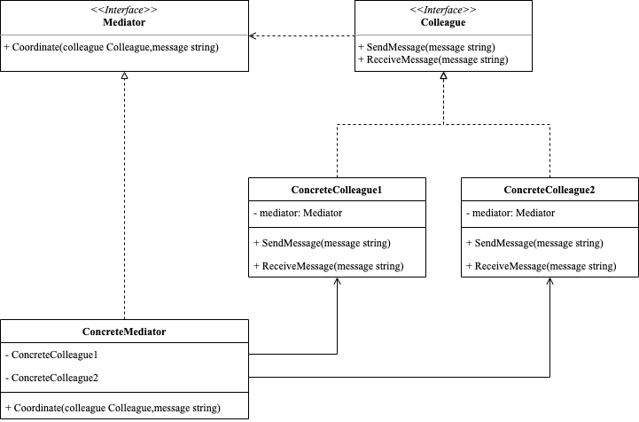

<!-- more -->

[[toc]]

## 什么是中介者模式

中介者模式(Mediator Pattern)又叫调停者模式，通过在中间引入中介对象来协调各个对象之间交互，使得对象之间不直接交互，而是通过中介者进行通信和协调，从而使得各个对象能够更加灵活地进行组合和拆分，增强系统的可维护性和扩展性。

### 包含哪些角色



- Mediator：中介者
  
  定义了中介者的接口，即通过该接口与其他组件交互

- ConcreteMediator：具体中介者
  
  实现了中介者的接口，维护其他组件之间的交互关系。

- Colleague：同事
  
  定义组件的接口，即通过该接口与中介者交互。

- ConcreteColleague：具体同事
  
  实现了组件的接口，维护自己与其他组件之间的交互关系。注意，同事之间不会直接交互，而是通过中介者来完成交互。

### 代码示例

```go
package mediator

import "fmt"

type Mediator interface {
	Coordinate(colleague Colleague, message string)
}

type Colleague interface {
	SendMessage(message string)
	ReceiveMessage(message string)
}

type ConcreteColleague1 struct {
	mediator Mediator
}

func (c *ConcreteColleague1) SendMessage(message string) {
	fmt.Println("ConcreateColleague1 send message:", message)
	c.mediator.Coordinate(c, message)
}

func (c *ConcreteColleague1) ReceiveMessage(message string) {
	fmt.Println("ConcreateColleague1 receive message:", message)
}

type ConcreteColleague2 struct {
	mediator Mediator
}

func (c *ConcreteColleague2) SendMessage(message string) {
	fmt.Println("ConcreateColleague2 send message:", message)
	c.mediator.Coordinate(c, message)
}

func (c *ConcreteColleague2) ReceiveMessage(message string) {
	fmt.Println("ConcreateColleague2 receive message:", message)
}

type ConcreteMediator struct {
	ConcreteColleague1
	ConcreteColleague2
}

func (c ConcreteMediator) Coordinate(colleague Colleague, message string) {
	switch colleague.(type) {
	case *ConcreteColleague1:
		c.ConcreteColleague2.ReceiveMessage(message)
	case *ConcreteColleague2:
		c.ConcreteColleague1.ReceiveMessage(message)
	}
}
```

使用示例

```go
package mediator

func ExampleMediator() {
	mediator := ConcreteMediator{}
	colleague1 := ConcreteColleague1{mediator: mediator}
	colleague2 := ConcreteColleague2{mediator: mediator}
	mediator.ConcreteColleague1 = colleague1
	mediator.ConcreteColleague2 = colleague2

	colleague1.SendMessage("hello")
	colleague2.SendMessage("hi")
	// Output:
	// ConcreateColleague1 send message: hello
	// ConcreateColleague2 receive message: hello
	// ConcreateColleague2 send message: hi
	// ConcreateColleague1 receive message: hi
}
```

## 总结

### 优点

- 降低系统复杂度：通过中介者对象，可以将系统中多个对象之间的直接交互关系转化为对中介者对象的请求调用，从而简化了系统的复杂度；

- 减低系统维护成本：通过减少对象之间的直接耦合度，提高了系统的灵活性和可维护性，降低了系统维护的成本；

- 提高系统扩展性：由于中介者对象独立负责对象之间的通信协调，因此增加、删除或修改一个对象都不会影响其他对象的交互关系，从而提高了系统的可扩展性。

### 缺点

- 中介者对象会引入系统的复杂度：虽然中介者对象可以简化系统的复杂度，但如果中介者对象本身过于复杂，可能会引入新的复杂度；

- 中介者对象可能成为系统的**瓶颈**：由于所有的交互都要经过中介者对象，当系统中对象数量较多或交互复杂时，中介者对象可能成为系统的瓶颈。
