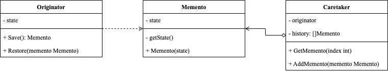

<!-- more -->

[[toc]]

## 什么是备忘录模式

备忘录模式(Memento Pattern)允许在不暴露对象实现细节的情况下保存和恢复对象之前的状态。

### 包含哪些角色



- Originator: 原发器
  
  用于生成自身状态的快照，在需要时可以通过快照恢复自身状态

- Memento: 备忘录
  
  原发器状态快照，通常将备忘录设置为不可变的类，并且通过构造函数一次性传递数据

- Caretaker: 负责人
  
  存储备忘录的历史记录

### 代码示例

```go
package memento

type Originator struct {
	state string
}

func NewOriginator(value string) *Originator {
	return &Originator{state: value}
}

func (o *Originator) ChangeState(value string) {
	o.state = value
}

func (o *Originator) Save() Memento {
	return NewMemento(o.state)
}

func (o *Originator) Restore(memento Memento) {
	o.state = memento.GetState()
}

type Memento struct {
	state string
}

func NewMemento(state string) Memento {
	return Memento{state: state}
}

func (m Memento) GetState() string {
	return m.state
}

type Caretaker struct {
	history []Memento
}

func (c *Caretaker) AddMemento(memento Memento) {
	c.history = append(c.history, memento)
}

func (c *Caretaker) GetMemento(index int) Memento {
	return c.history[index]
}
```

使用示例

```go
package memento

import "fmt"

func ExampleMemento() {
	caretaker := Caretaker{history: make([]Memento, 0)}
	originator := NewOriginator("one")
	caretaker.AddMemento(originator.Save())
	fmt.Println(originator.state)
	originator.ChangeState("two")
	caretaker.AddMemento(originator.Save())
	fmt.Println(originator.state)
	originator.ChangeState("three")
	caretaker.AddMemento(originator.Save())
	fmt.Println(originator.state)
	originator.Restore(caretaker.GetMemento(1))
	fmt.Println(originator.state)
	// Output:
	// one
	// two
	// three
	// two
}
```

## 总结

### 优点

- 可以在不破坏对象封装性的前提下捕获并存储对象的状态；
- 简化了对象在不同状态之间的切换过程，避免了大量的 if-else 语句；
- 原发器和负责人之间的解耦，原发器只需要知道如何创建备忘录和恢复备忘录即可，而负责人则负责保存备忘录。

### 缺点

- 使用备忘录会占用一定的内存空间；
- 当原发器的状态改变很频繁时，备忘录对象的数量会很大，会占用较大的内存空间；
- 如果原发器需要保存的状态很多，那么备忘录对象的创建和恢复操作就会变得很慢。
