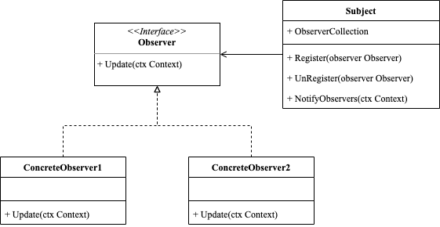

<!-- more -->

[[toc]]

## 什么是观察者模式

观察者模式(Observer Pattern)定义了对象之间的一对多依赖关系，当一个对象的状态发生变化时，所有依赖关系都会自动得到通知和更新。类似订阅机制，对象变化时通知多个**观察**该对象的其他对象。

### 包含哪些角色



- Observer: 观察者
  
  声明了通知接口，在绝大数情况下，该接口仅包含一个`update`方法，该方法可以有多个参数

- Subject: 主题
  
  提供一个用于存储观察者对象的聚集类，该类通常包含`注册`和`取消注册`观察者的方法，以及通知所有观察者变化的方法。

- ConcreteObserver: 具体的观察者
  
  实现观察者接口定义的方法，根据自己的需要，实现对象变化时具体的行为。

### 代码示例

```go
package observer

import "fmt"

type Context struct {
	Id string
}

type Observer interface {
	Update(ctx Context)
}

type ConcreteObserver1 struct {
}

func (c ConcreteObserver1) Update(ctx Context) {
	fmt.Println("concrete observer 1 update ctx:", ctx)
}

type ConcreteObserver2 struct {
}

func (c ConcreteObserver2) Update(ctx Context) {
	fmt.Println("concrete observer 2 update ctx:", ctx)
}

type Subject struct {
	ObserverCollection []Observer
}

func (s *Subject) Register(observer Observer) {
	s.ObserverCollection = append(s.ObserverCollection, observer)
}

func (s *Subject) UnRegister(observer Observer) {
	for i := 0; i < len(s.ObserverCollection); i++ {
		if s.ObserverCollection[i] == observer {
			s.ObserverCollection = append(s.ObserverCollection[:i], s.ObserverCollection[i+1:]...)
			break
		}
	}
}

func (s *Subject) NotifyObservers(ctx Context) {
	for i := 0; i < len(s.ObserverCollection); i++ {
		s.ObserverCollection[i].Update(ctx)
	}
}
```

使用示例

```go
package observer

func ExampleObserver() {
	ctx := Context{"test"}
	co1 := ConcreteObserver1{}
	co2 := ConcreteObserver2{}
	subject := Subject{
		ObserverCollection: make([]Observer, 0),
	}
	subject.Register(co1)
	subject.Register(co2)
	subject.NotifyObservers(ctx)
	ctx.Id = "other"
	subject.UnRegister(co1)
	subject.NotifyObservers(ctx)
	// Output:
	// concrete observer 1 update ctx: {test}
	// concrete observer 2 update ctx: {test}
	// concrete observer 2 update ctx: {other}
}
```

## 总结

### 优点

- 松耦合：观察者模式使主题和观察者之间的依赖关系变得松散，让它们可以独立演化，这样就可以在不影响主题的情况下修改或扩展观察者。
- 可重用性：由于主题和观察者之间的关系被封装在抽象接口中，因此可以方便地添加新的观察者或主题，从而提高代码的可重用性和可维护性。
- 通知机制：一旦主题状态发生变化，观察者会自动被通知，并且可以及时更新自己的状态，从而保证了数据的一致性。

### 缺点

- 性能问题：如果观察者过多，通知所有观察者会浪费很多资源，可能会导致系统运行缓慢。
- 难以理解：当涉及多个对象之间的交互时，观察者模式可能比较难以理解和调试
  