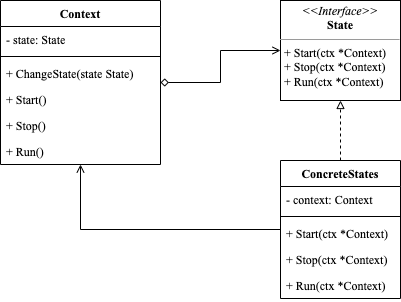

<!-- more -->

[[toc]]

## 什么是状态模式

状态模式(State Pattern) 允许对象在其内部状态发生变化时改变其行为。通过将状态转换代码从主逻辑中抽离并封装在状态对象中，使得对象能够在行为上进行更灵活的变化。

### 包含哪些角色



- Context: 上下文

  它是包含状态的主对象。它还包含一些用于在状态之间切换的方法。

- State: 状态

  它定义一个接口，用于封装与上下文的特定状态相关的行为。

- ConcreteStates: 具体状态类

  实现State接口，每个具体状态都提供各自的实现方式。

### 代码示例

```go
package state

import "fmt"

type Context struct {
	state State
}

func (c *Context) ChangeState(state State) {
	c.state = state
}

func (c *Context) Start() {
	c.state.Start(c)
}

func (c *Context) Stop() {
	c.state.Stop(c)
}

func (c *Context) Run() {
	c.state.Run(c)
}

type State interface {
	Start(ctx *Context)
	Stop(ctx *Context)
	Run(ctx *Context)
}

type StartState struct {
}

func (s *StartState) Start(ctx *Context) {
	fmt.Println("already start")
}

func (s *StartState) Stop(ctx *Context) {
	fmt.Println("change start state to stop")
	ctx.ChangeState(&StopState{})
}

func (s *StartState) Run(ctx *Context) {
	fmt.Println("change start state to run")
	ctx.ChangeState(&RunState{})
}

type StopState struct {
}

func (s *StopState) Start(ctx *Context) {
	fmt.Println("change stop state to start")
	ctx.ChangeState(&StartState{})
}

func (s *StopState) Stop(ctx *Context) {
	fmt.Println("already stop")
}

func (s *StopState) Run(ctx *Context) {
	fmt.Println("can't change stop state to run")
}

type RunState struct {
}

func (s *RunState) Start(ctx *Context) {
	fmt.Println("can't change run state to start")
}

func (s *RunState) Stop(ctx *Context) {
	fmt.Println("change run state to stop")
	ctx.ChangeState(&StopState{})
}

func (s *RunState) Run(ctx *Context) {
	fmt.Println("already run")
}
```

使用示例

```go
package state

func ExampleState() {
	start := &StartState{}
	context := Context{state: start}
	context.Start()
	context.Run()
	context.Stop()
	context.Run()
	// Output:
	// already start
	// change start state to run
	// change run state to stop
	// can't change stop state to run
}
```

## 总结

### 优点

- 将状态抽象成对象，使得状态之间的转换更加清晰明了。通过将每种状态封装成具体的类，可以使代码更加简单易懂，避免了状态转换时大量的条件判断。
- 状态之间的转换变得容易扩展。由于状态之间的转换是由状态对象自身完成的，因此只需要增加、修改或删除对应的状态类即可扩展或修改状态转换，而不影响其他部分。
- 提高代码的复用性和灵活性。由于每个状态都是一个独立的对象，因此可以在不同的上下文中重复使用。这样，就可以实现更多的组合方式，从而提高代码的复用性和灵活性。

### 缺点

- 对于简单的状态机，引入状态模式会增加额外的复杂度。如果状态机只有几个状态，那么引入状态模式可能会让代码更加复杂，难以维护。

- 增加了系统的类和对象数量。引入状态模式会增加额外的类和对象，在一定程度上增加了系统的复杂度和开销。
  