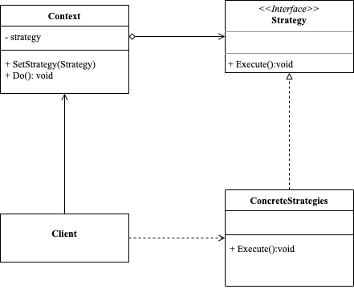

<!-- more -->

[[toc]]

## 什么是策略模式

策略模式(Strategy Pattern)定义了算法族，分别封装起来，让他们之间可以互相替换，此模式让算法的变化独立于使用算法的客户。策略模式属于对象行为模式，它通过对算法进行封装，把使用算法的责任和算法的实现分割开来，并委派给不同的对象对这些算法进行管理。

### 包含哪些角色



- Strategy: 策略接口
  
  是所有具体策略的通用接口，它声明了一个上下文用于执行策略的方法

- Concrete Strategies: 具体策略，实现了上下文所用算法的各种不同变体；
- Context: 上下文，维护指向具体策略的引用，且仅通过策略接口与该对象进行交流；

### 代码示例

```go
package strategy

import "fmt"

type Strategy interface {
	Execute()
}

type ConcreteStrategy1 struct {
}

func (s ConcreteStrategy1) Execute() {
	fmt.Println("concrete strategy1 execute")
}

type ConcreteStrategy2 struct {
}

func (s ConcreteStrategy2) Execute() {
	fmt.Println("concrete strategy2 execute")
}

type Context struct {
	strategy Strategy
}

func (c *Context) SetStrategy(strategy Strategy) {
	c.strategy = strategy
}

func (c *Context) Do() {
	fmt.Println("do something")
	c.strategy.Execute()
}
```

使用示例

```go
package strategy

func ExampleStrategy() {
	c := Context{}
	s1 := ConcreteStrategy1{}
	c.SetStrategy(s1)
	c.Do()
	s2 := ConcreteStrategy2{}
	c.SetStrategy(s2)
	c.Do()
	// Output:
	// do something
	// concrete strategy1 execute
	// do something
	// concrete strategy2 execute
}
```

## 总结

### 优点

- 可以在运行时切换对象内的算法。
- 可以将算法的实现和使用算法的代码隔离开来。
- 可以使用组合来代替继承。
- 开闭原则，无需对上下文进行修改就能够引入新的策略。

### 缺点

- 如果你的算法极少发生改变， 那么没有任何理由引入新的类和接口。 使用该模式只会让程序过于复杂。
- 客户端必须知晓策略间的不同——它需要选择合适的策略。
- 许多现代编程语言支持函数类型功能， 允许你在一组匿名函数中实现不同版本的算法。 这样， 你使用这些函数的方式就和使用策略对象时完全相同， 无需借助额外的类和接口来保持代码简洁。
