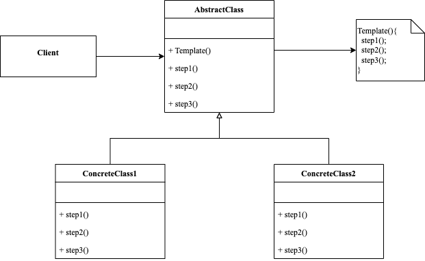

<!-- more -->

[[toc]]

## 场景问题

例如：假设开发一个文档的数据挖局程序，输入各种格式的文档（PDF、DOC、CSV、...），程序从这些文档中提取有意义的数据，进行处理和分析，并返回给用户。随着开发进行，实现三个类分别是：PDFDataMiner、DOCDataMiner、CSVDataMiner，它们都有相似的处理逻辑：打开文件、提取数据、转换数据、分析数据、发送报告。其中：分析数据和发送报告模块完全一致。
那么我们就可以使用模版方法模式将步骤进行抽象，并提供步骤的默认实现，支持重写。

## 什么是模版方法模式

模版方法模式（Template Method Pattern），将总结出来的规律沉淀为一种既定格式，并固化于模版中以供子类继承，对未确定下来的步骤方法进行抽象化，使其得以延续、多态化，最终架构起一个平台，使系统实现在不改变预设规则的前提下，对每个分步骤进行个性化定义的目的。

### 包含哪些角色



- AbstractClass: 抽象类
  
  负责给出一个算法的轮廓和骨架。它由一个模版方法和若干个基本方法构成

- ConCreteClass: 具体实现类
  
  复用抽象类的方法，或者重写相关方法。

### 代码示例

由于Go语言没有抽象类这一概念，我们使用接口实现。

```go
package templatemethod

import "fmt"

type Templater interface {
	Template()
}

type Implement interface {
	step1()
	step2()
	step3()
}

type Abstract struct {
	Implement
}

func newAbstract(impl Implement) *Abstract {
	return &Abstract{Implement: impl}
}

func (t *Abstract) Template() {
	t.Implement.step1()
	t.Implement.step2()
	t.Implement.step3()
}

func (t *Abstract) step2() {
	fmt.Println("default step2")
}

type Concreate1 struct {
	*Abstract
}

func NewConcreate1() Templater {
	c := &Concreate1{}
	a := newAbstract(c)
	c.Abstract = a
	return c
}

func (*Concreate1) step1() {
	fmt.Println("concreate1 step1")
}

func (*Concreate1) step2() {
	fmt.Println("concreate1 step2")
}

func (*Concreate1) step3() {
	fmt.Println("concreate1 step3")
}

type Concreate2 struct {
	*Abstract
}

func NewConcreate2() Templater {
	c := &Concreate2{}
	a := newAbstract(c)
	c.Abstract = a
	return c
}

func (*Concreate2) step1() {
	fmt.Println("concreate2 step1")
}

func (*Concreate2) step3() {
	fmt.Println("concreate2 step3")
}
```

使用示例

```go
func ExampleTemplate() {
	var t Templater
	t = NewConcreate1()
	t.Template()
	t = NewConcreate2()
	t.Template()
	// Output:
	// concreate1 step1
	// concreate1 step2
	// concreate1 step3
	// concreate2 step1
	// default step2
	// concreate2 step3
}
```

其中concreate2并未实现step2()，而是使用了默认的step2()

## 总结

### 优点

- 允许客户端重写一个大型算法中的特定部分，使得算法其他部分修改对其所造成的影响较小。
  
### 缺点

- 部分客户端可能受到算法框架的限制
- 通过子类一直默认步骤实现可能会导致违反里氏替换原则
- 模版方法中的步骤越多，其维护工作就可能会越困难
