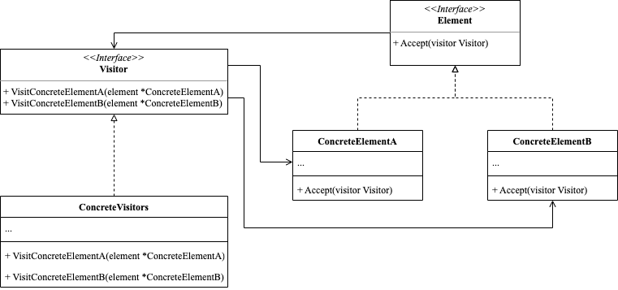

<!-- more -->

[[toc]]

## 什么是访问者模式

访问者模式(Visitor Pattern)将算法与对象结构分离开来，并在结构中增加可操作元素的能力。其主要思想是在不改变已有类的前提下，通过增加访问者类，来给已有类增加新的操作方法。

### 包含哪些角色



- Visitor: 访问者
  
  声明了一些列以对象结构的具体元素为参数的访问者方法

- ConCreteVistors: 具体访问者
  
  不同的具体访问者实现访问元素对象各不相同

- Element: 元素
  
  声明了一个方法来接收访问者

- ConcreteElement: 具体元素

  具体元素实现接收方法，该方法根据当前访问者类调用相应访问者方法。

### 代码示例

```go
package visitor

import "fmt"

type Visitor interface {
	VisitConcreteElementA(element *ConcreteElementA)
	VisitConcreteElementB(element *ConcreteElementB)
}

type ConcreteVisitor struct{}

func (c *ConcreteVisitor) VisitConcreteElementA(element *ConcreteElementA) {
	fmt.Println("Visit ConcreteElementA")
}

func (c *ConcreteVisitor) VisitConcreteElementB(element *ConcreteElementB) {
	fmt.Println("Visit ConcreteElementB")
}

type Element interface {
	Accept(visitor Visitor)
}

type ConcreteElementA struct{}

func (c *ConcreteElementA) Accept(visitor Visitor) {
	visitor.VisitConcreteElementA(c)
}

type ConcreteElementB struct{}

func (c *ConcreteElementB) Accept(visitor Visitor) {
	visitor.VisitConcreteElementB(c)
}
```

使用示例

```go
package visitor

func ExampleVisitor() {
	visitor := &ConcreteVisitor{}
	elementA := &ConcreteElementA{}
	elementB := &ConcreteElementB{}
	elementA.Accept(visitor)
	elementB.Accept(visitor)
	// Output:
	// Visit ConcreteElementA
	// Visit ConcreteElementB
}
```

## 应用场景

- 当对象结构比较稳定，但需要经常定义新的操作时，访问者模式可以使用。
- 当一组对象中，需要执行不同的、复杂的操作时，可以使用访问者模式来封装这些操作，以简化代码逻辑。

### 在不修改已有代码的情况下，向已有类层次结构增加新的行为

假如当前已有三种稳定图形类：正方形、圆形、三角形。当前需求是获取这三种图形的面积和周长，且未来可能有其他的行为操作。

```go
package visitor

import "math"

type Shape interface {
	Accept(visitor CalculateVisitor)
}

type CalculateVisitor interface {
	VisitSquare(s *Square)
	VisitRectangle(r *Rectangle)
	VisitCircle(c *Circle)
}

// 正方形
type Square struct {
	SideLength float64
}

func (s *Square) Accept(visitor CalculateVisitor) {
	visitor.VisitSquare(s)
}

// 长方形
type Rectangle struct {
	Width  float64
	Height float64
}

func (r *Rectangle) Accept(visitor CalculateVisitor) {
	visitor.VisitRectangle(r)
}

// 圆形
type Circle struct {
	Radius float64
}

func (c *Circle) Accept(visitor CalculateVisitor) {
	visitor.VisitCircle(c)
}

// 面积访问者
type AreaVisitor struct {
	Area float64
}

func (av *AreaVisitor) VisitSquare(s *Square) {
	av.Area = s.SideLength * s.SideLength
}

func (av *AreaVisitor) VisitRectangle(r *Rectangle) {
	av.Area = r.Width * r.Height
}

func (av *AreaVisitor) VisitCircle(c *Circle) {
	av.Area = math.Pi * c.Radius * c.Radius
}

// 周长访问者
type PerimeterVisitor struct {
	Perimeter float64
}

func (pv *PerimeterVisitor) VisitSquare(s *Square) {
	pv.Perimeter = 4 * s.SideLength
}

func (pv *PerimeterVisitor) VisitRectangle(r *Rectangle) {
	pv.Perimeter = 2 * (r.Width + r.Height)
}

func (pv *PerimeterVisitor) VisitCircle(c *Circle) {
	pv.Perimeter = 2 * math.Pi * c.Radius
}
```

使用示例

```go
package visitor

import "fmt"

func ExampleShape() {
	square := &Square{SideLength: 4.0}
	rectangle := &Rectangle{Width: 3.0, Height: 5.0}
	circle := &Circle{Radius: 2.0}

	areaVisitor := &AreaVisitor{}
	square.Accept(areaVisitor)
	fmt.Println("square area:", areaVisitor.Area)
	rectangle.Accept(areaVisitor)
	fmt.Println("rectangle area:", areaVisitor.Area)
	circle.Accept(areaVisitor)
	fmt.Println("circle area:", areaVisitor.Area)

	perimeterVisitor := &PerimeterVisitor{}
	square.Accept(perimeterVisitor)
	fmt.Println("square perimeter:", perimeterVisitor.Perimeter)
	rectangle.Accept(perimeterVisitor)
	fmt.Println("rectangle perimeter:", perimeterVisitor.Perimeter)
	circle.Accept(perimeterVisitor)
	fmt.Println("circle perimeter:", perimeterVisitor.Perimeter)

	// Output:
	// square area: 16
	// rectangle area: 15
	// circle area: 12.566370614359172
	// square perimeter: 16
	// rectangle perimeter: 16
	// circle perimeter: 12.566370614359172
}
```

这里只需要实现面积访问者类和周长访问者类就可以不用动三个图形类。

## 总结

### 优点

- 增加新的操作时不需要改变现有的对象结构，只需要增加新的访问者即可。
- 结构和操作分离，符合**单一职责原则**和**开闭原则**，降低了系统的耦合度。
- 把数据结构和操作分离，可以使得代码更容易理解和维护。

### 缺点

- 增加新的元素时比较困难，需要修改抽象访问者的接口以及所有的具体访问者的实现。
- 访问者模式将对象本身和操作分离开来，导致增加新的操作不够方便。
