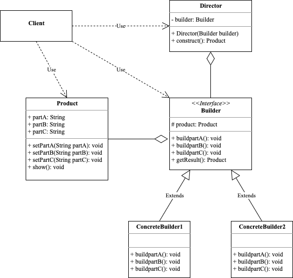

<!-- more -->

[[toc]]

## 什么是建造者模式

建造者模式(Builder Pattern)又叫生成器模式，它将一个复杂对象的构建与它的表示分离。使统一的构建过程可以创建不同的表示。

它将一个复杂的对象分解为多个简单的对象，然后一步一步构建而成，它将变与不变相分离，即产品的组成部分是不变的，但每一部分是可以灵活选择的。

### 包含哪些角色



- Product：产品角色

  包含多个组成部分的复杂对象，由具体建造者来创建各个零部件。

- Builder：抽象建造者

  包含创建产品各个子部件的抽象方法的接口，通常还包含一个返回复杂产品的方法getResult()。

- Concrete Builder：具体建造者

  实现Builder接口，完成复杂产品的各个部件的具体创建方法。

- Director：指挥者

  调用建造者对象中的部件构建与装配方法完成复杂对象的创建，在指挥者中不涉及具体产品的信息。

### 代码示例

```go
package builder

import "fmt"

type Product struct {
	partA string
	partB string
	partC string
}

func (p *Product) setPartA(partA string) {
	p.partA = partA
}

func (p *Product) setPartB(partB string) {
	p.partB = partB
}

func (p *Product) setPartC(partC string) {
	p.partC = partC
}

func (p Product) show() {
	fmt.Printf("A:%s\tB:%s\tC:%s", p.partA, p.partB, p.partC)
}

type Builder interface {
	buildPartA()
	buildPartB()
	buildPartC()
	getResult() Product
}

type Director struct {
	builder Builder
}

func (d *Director) Director(builder Builder) {
	d.builder = builder
}

func (d Director) construct() Product {
	d.builder.buildPartA()
	d.builder.buildPartB()
	d.builder.buildPartC()
	return d.builder.getResult()
}

type ConcreteBuilder1 struct {
	product *Product
}

func (c ConcreteBuilder1) buildPartA() {
	c.product.setPartA("A1")
}

func (c ConcreteBuilder1) buildPartB() {
	c.product.setPartB("B1")
}

func (c ConcreteBuilder1) buildPartC() {
	c.product.setPartC("C1")
}

func (c ConcreteBuilder1) getResult() Product {
	return *c.product
}

type ConcreteBuilder2 struct {
	product *Product
}

func (c ConcreteBuilder2) buildPartA() {
	c.product.setPartA("A2")
}

func (c ConcreteBuilder2) buildPartB() {
	c.product.setPartB("B2")
}

func (c ConcreteBuilder2) buildPartC() {
	c.product.setPartC("C2")
}

func (c ConcreteBuilder2) getResult() Product {
	return *c.product
}
```

使用示例如下：

```go
package builder

func ExampleDirector() {
	builder := ConcreteBuilder1{product: &Product{}}
	var director Director
	director.Director(builder)
	product := director.construct()
	product.show()
	// Output: A:A1	B:B1	C:C1
}

func ExampleDirector_second() {
	builder := ConcreteBuilder2{product: &Product{}}
	var director Director
	director.Director(builder)
	product := director.construct()
	product.show()
	// Output: A:A2	B:B2	C:C2
}
```

### 应用场景

客厅装修是一个复杂的过程，包含：墙体的装修、电视机的选择、沙发的购买与布局等。客户把装修要求告诉项目经理，项目经理指挥工人一步步装修，最后完成整个客厅的装修与布局。

## 总结

### 优点

- 封装性好，构建和表示分离。
- 扩展性好，各个具体的建造者相互独立，有利于系统的解耦。
- 客户端不必知道产品内部组成的细节，建造者可以对创建过程逐步细化，而不对其他模块产生任何影响，便于控制细节风险。

### 缺点

- 产品的组成部分必须相同，这限制了其使用范围。
- 如果产品内部发生变化，则建造者也要同步修改，后期维护成本较大。

## 对比

### 建造者模式和工厂模式

建造者模式和工厂模式的关注点不同：建造者模式注重零部件的组装过程，而工厂方法模式更注重零部件的创建过程，两者可以结合使用。
