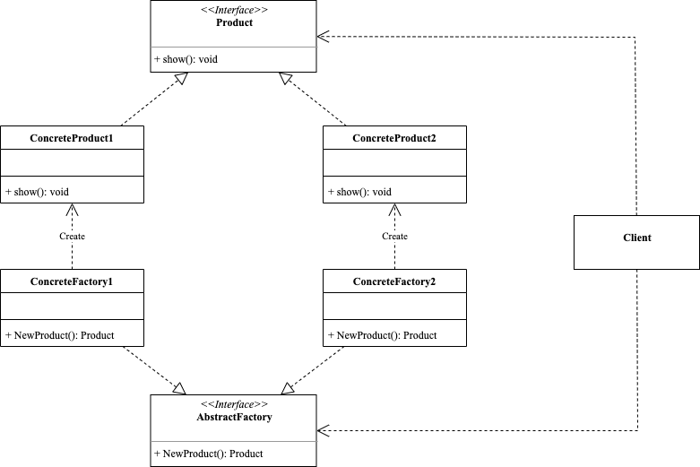

<!-- more -->

[[toc]]

## 什么是工厂方法模式

工厂方法模式(Factory Method Pattern)也叫虚拟构造器(Virtual Constructor)模式，由于简单工厂模式违背了开闭原则，而工厂方法模式对简单工厂模式进一步抽象，其好处是可以使系统在不修改原来代码的情况下引进新的产品，即满足开闭原则。

### 包含哪些角色



- Abstract Factory：抽象工厂

  提供了创建产品的接口，调用者通过它访问具体工厂的工厂方法NewProduct()来创建产品。

- Concrete Factory：具体工厂

  实现了抽象工厂的方法，完成具体产品的创建。

- Product：抽象产品

  定义了产品的规范，描述了产品的主要特性和功能。

- Concrete Product：具体产品

  实现了抽象产品定义的接口，由具体工厂来创建，它同具体工厂之间一一对应。

### 代码示例

```go
package factory_method

import "fmt"

// 抽象产品
type Product interface {
	Show()
}

// 抽象工厂
type AbstractFactory interface {
	NewProduct() Product
}

// 具体产品1
type ConcreteProduct1 struct{}

func (*ConcreteProduct1) Show() {
	fmt.Println("Product1 show")
}

// 具体工厂1
type ConcreteFactory1 struct{}

func (ConcreteFactory1) NewProduct() Product {
	return &ConcreteProduct1{}
}

// 具体产品2
type ConcreteProduct2 struct{}

func (*ConcreteProduct2) Show() {
	fmt.Println("Product2 show")
}

// 具体工厂2
type ConcreteFactory2 struct{}

func (ConcreteFactory2) NewProduct() Product {
	return &ConcreteProduct2{}
}
```

使用工厂创建产品示例如下：

```go
package factory_method

func ExampleConcreteFactory1_NewProduct() {
	var factory AbstractFactory
	factory = ConcreteFactory1{}
	product := factory.NewProduct()
	product.Show()
	// Output:
	// Product1 show
}

func ExampleConcreteFactory2_NewProduct() {
	var factory AbstractFactory
	factory = ConcreteFactory2{}
	product := factory.NewProduct()
	product.Show()
	// Output:
	// Product2 show
}
```

### 应用场景

例如：电视工厂有TCL电视工厂、海信电视工厂，我们只需要提供品牌名称，就可以获取对应工厂的电视。

## 总结

### 优点

- 用户只需要知道具体工厂的名称就可得到所要的产品，无须知道产品的具体创建过程。
- 灵活性增强，对于新产品的创建，只需要多写一个相应的工厂类。
- 典型的解耦框架，高层模块只需要知道产品的抽象类，无须关心其他实现类，满足迪米特法则、依赖倒置原则和里氏替换原则。

### 缺点

- 类的个数容易过多，增加复杂度。
- 增加系统的抽象性和理解难度。
- **抽象产品只能生产一种产品**。此弊端可使用抽象工厂模式解决。

## 对比

### 简单工厂和工厂方法

简单工厂模式是由一个工厂类负责创建所有产品的实例，客户端只需要告诉工厂要创建哪种产品，工厂就会返回相应的产品实例。简单工厂模式的优点是将创建实例的逻辑集中到了一个工厂类中，客户端不需要直接与具体产品类打交道，减少了客户端和产品类之间的依赖关系和耦合度。但是简单工厂模式的缺点是，一旦有新的产品添加到系统中，就需要修改工厂类的代码，违反了开闭原则。

工厂方法模式是将每个具体产品的创建逻辑交给对应的工厂类来实现。每个具体工厂类负责创建一个具体产品类的实例，这样客户端只需面对抽象工厂和抽象产品接口，而不需要知道具体的产品类。工厂方法模式的优点是符合开闭原则，新增加一种产品时，只需要增加相应的具体产品类和具体工厂类即可，不需要修改现有代码。但是，工厂方法模式的缺点是增加了系统中类的个数，增加了系统的复杂度。

因此，在实际应用中，需要根据具体业务场景选择合适的设计模式。如果产品种类不多且不经常变动，可以考虑使用简单工厂模式；如果产品种类较多，需要频繁添加新的产品，可以选择工厂方法模式。
