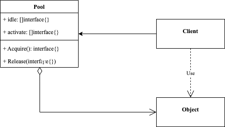

<!-- more -->

[[toc]]

## 什么是对象池模式

> 对象池模式(Object Pool Pattern)：对象被预先初始化并存储在对象池中，当需要时，客户端可以从对象池中请求一个对象并使用，使用结束后将它放回对象池中。

### 包含哪些角色



- Pool：对象池

  对象池维护活动对象列表和空闲对象列表

- Object：对象

  对象被客户端使用

### 代码示例

```go
package object_pool

import (
	"sync"
)

type pool struct {
	mutex     *sync.Mutex
	idle      []interface{}
	active    []interface{}
	newObject func() interface{}
}

func NewPool(newFunc func() interface{}) *pool {
	return &pool{
		mutex:     &sync.Mutex{},
		idle:      make([]interface{}, 0),
		active:    make([]interface{}, 0),
		newObject: newFunc,
	}
}

func (p *pool) Acquire() interface{} {
	p.mutex.Lock()
	defer p.mutex.Unlock()
	var object interface{}
	if len(p.idle) == 0 {
		object = p.newObject()
	} else {
		object = p.idle[0]
		p.idle = p.idle[1:]
	}
	p.active = append(p.active, object)
	return object
}

func (p *pool) Release(target interface{}) {
	p.mutex.Lock()
	defer p.mutex.Unlock()
	p.idle = append(p.idle, target)
	for i := range p.active {
		if p.active[i] == target {
			p.active = append(p.active[:i], p.active[i+1:]...)
			break
		}
	}
}
```

使用示例

```go
package object_pool

import (
	"fmt"
)

func ExamplePool() {
	newConnDB := func() interface{} {
		return "conn-db"
	}
	pool := NewPool(newConnDB)
	object1 := pool.Acquire()
	fmt.Println(len(pool.idle))
	fmt.Println(len(pool.active))

	object2 := pool.Acquire()
	fmt.Println(len(pool.idle))
	fmt.Println(len(pool.active))

	pool.Release(object1)
	fmt.Println(len(pool.idle))
	fmt.Println(len(pool.active))

	pool3 := pool.Acquire()
	fmt.Println(len(pool.idle))
	fmt.Println(len(pool.active))

	pool.Release(object2)
	pool.Release(pool3)
	fmt.Println(len(pool.idle))
	fmt.Println(len(pool.active))
	// Output:
	// 0
	// 1
	// 0
	// 2
	// 1
	// 1
	// 0
	// 2
	// 2
	// 0
}
```

### 使用场景

- 当创建类的成本很高并且特定时间需要的此类对象的数量不多时
- 当对象是不可变对象时，例如：数据库连接是不可变对象，不需要更改它的属性
- 基于性能，由于池已经创建，它将显著提高应该程序性能

## 总结

### 优点

- 对象池模式可以重复利用池中的对象，减少频繁创建对象带来的性能开销。

### 缺点

- 将对象返回对象池中的操作依赖于客户端，如果客户端忘记将对象返回对象池中，将导致该对象无法被其他组件使用
