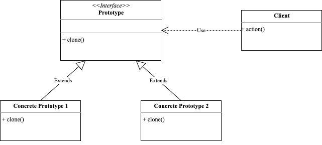

<!-- more -->

## 原型模式

> 原型模式(Prototype Pattern)用一个已经创建的实例作为原型，通过复制该原型对象来创建一个和原型相同或相似的新对象。

### 角色

- 抽象原型：规定了具体原型对象必须实现的接口
- 具体原型：实现抽象原型的clone()方法，是可被复制的对象
- 访问：使用具体原型类中的clone()方法来复制新的对象



### 示例

```go
package prototype

import "fmt"

type inode interface {
	print(string)
	clone() inode
}

type file struct {
	name string
}

func (f *file) print(indentation string) {
	fmt.Println(indentation + f.name)
}

func (f *file) clone() inode {
	return &file{name: f.name + "_clone"}
}

type folder struct {
	children []inode
	name     string
}

func (f *folder) print(indentation string) {
	fmt.Println(indentation + f.name)
	for _, i := range f.children {
		i.print(indentation + indentation)
	}
}

func (f *folder) clone() inode {
	cloneFolder := &folder{name: f.name + "_clone"}
	var tempChildren []inode
	for _, i := range f.children {
		copy := i.clone()
		tempChildren = append(tempChildren, copy)
	}
	cloneFolder.children = tempChildren
	return cloneFolder
}
```
使用示例如下：
```go
package prototype

func ExampleFile() {
	file1 := &file{name: "file1"}
	cloneFile := file1.clone()
	cloneFile.print("example_")
	// Output:
	// example_file1_clone
}

func ExampleFolder() {
	file1 := &file{name: "file1"}
	file2 := &file{name: "file2"}
	file3 := &file{name: "file3"}
	folder1 := &folder{
		name:     "folder1",
		children: []inode{file1, file2, file3},
	}
	cloneFolder := folder1.clone()
	cloneFolder.print("example_")
	// Output:
	// example_folder1_clone
	// example_example_file1_clone
	// example_example_file2_clone
	// example_example_file3_clone
}
```