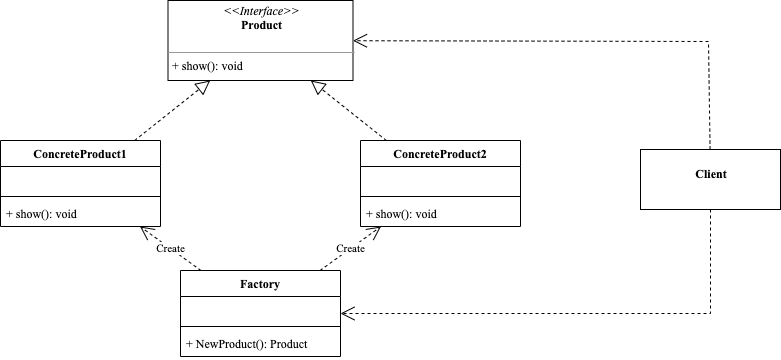

<!-- more -->

[[toc]]

## 什么是简单工厂模式

简单工厂模式(Simple Factory Pattern)又称为静态工厂方法(Static Factory Method)模式

::: tip
它可以根据参数的不同，返回不同类的实例，而无需让客户端知道具体的创建细节。
:::

### 包含哪些角色



- SimpleFactory：简单工厂

  简单工厂根据参数的不同创建并返回不同的产品实例。

- Product：抽象产品

  抽象产品负责描述所有实例所共有的公共接口。

- ConcreteProduct：具体产品

  具体产品实现产品的具体行为。

### 代码示例

```go
package simple_factory

import "fmt"

// 抽象产品
type Product interface {
	Show()
}

const (
	Product1 = 1 + iota
	Product2
)

// 工厂
type SimpleFactory struct{}

func (SimpleFactory) NewProduct(i int) Product {
	switch i {
	case Product1:
		return &ConcreteProduct1{}
	case Product2:
		return &ConcreteProduct2{}
	}
	return nil
}

// 具体产品1
type ConcreteProduct1 struct{}

func (*ConcreteProduct1) Show() {
	fmt.Println("Product1 show")
}

// 具体产品2
type ConcreteProduct2 struct{}

func (*ConcreteProduct2) Show() {
	fmt.Println("Product2 show")
}
```

使用示例：只需要传入产品的参数，就可以获得该产品

```go
package simple_factory

func ExampleSimpleFactory_NewProduct1() {
	factory := SimpleFactory{}
	product := factory.NewProduct(Product1)
	product.Show()
	// Output:
	// Product1 show
}

func ExampleSimpleFactory_NewProduct2() {
	factory := SimpleFactory{}
	product := factory.NewProduct(Product2)
	product.Show()
	// Output:
	// Product2 show
}
```

### 有哪些应用场景

- 创建对象少：工厂类负责创建的对象比较少。
- 不关心创建过程：客户端只知道传入工厂类的参数，对于如何创建对象不关心。

例如：

- 对于**门**这个产品，我们只需要给定的**材料**参数，工厂就会给我们创建`木门`、`铁门`、`玻璃门`等等。

### 有哪些优缺点

#### 优点

- 实现了对象的创建和使用分离，降低了系统的耦合性。
- 通过该模式，实现了对责任的分配，提高了系统的灵活性和可维护性。

#### 缺点

- 扩展性差，如果要增加新的产品类，就需要修改工厂类的代码，违背了**开闭**原则
- 由于使用了静态工厂方法，造成工厂角色无法形成基于继承的结构
- 如果产品种类较多，工厂方法的代码将会非常复杂

## 总结

简单工厂设计模式是一种创建型设计模式，它可以根据参数的不同，返回不同类的实例，而无需让客户端知道具体的创建细节。简单工厂设计模式有利于实现对象的创建和使用分离，降低了系统的耦合性，提高了系统的灵活性和可维护性。但是，简单工厂设计模式也有缺点，它扩展性差，如果要增加新的产品类，就需要修改工厂类的代码，违背了开闭原则。而且，工厂类的职责过重，如果产品种类较多，工厂方法的代码将会非常复杂。因此，简单工厂设计模式适用于创建对象少且不关心创建过程的场景。
