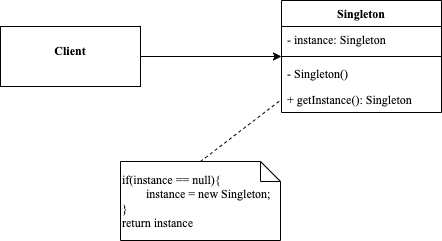

<!-- more -->

[[toc]]

## 什么是单例模式

单例模式(Singleton Pattern)指一个类只允许创建一个对象或者实例，那这个类就是一个单例类，这种设计模式就叫做单例设计模式。

### 包含哪些角色



- Singleton：单例类
  
  单例类提供getInstance方法获取实例

### 有哪些类别

单例模式从实现上分为两种：

- 饿汉模式：类加载时，instance静态实例就已经创建并初始化好了
  - 好处在于：对于耗时较高的初始化操作，提前到程序启动的时候完成，这样就能避免在程序运行的时候，再去初始化导致的性能问题。如果初始化有问题，基于fail-fast的设计原则（有问题及早暴露），而不是等待使用的时候才反馈问题会更好。
- 懒汉模式：程序需要某个变量的时候才会去初始化
  - 缺点在于：需要增加一把锁，导致并发度低。频繁的使用，也会频繁的加锁、释放锁，可能导致性能瓶颈。通常我们会采用双重检测，一旦instance创建之后就不再加锁。

### 有哪些特点

- 单例类只有一个实例对象；
- 该单例对象必须由单例类自行创建；
- 单例类对外提供一个访问该单例的全局访问点；

### 有哪些应用场景

- 配置文件实例--通常我们在应用运行期间，只使用一个配置文件实例；
- DB实例--我们只想创建DB对象的一个实例，并且该实例将在整个应用程序中使用；
- 日志实例--同样，只应创建一个日志实例，并应在整个应用程序中使用它；

### 有哪些优缺点

#### 优点

- 可以减少内存开销，提高程序的运行效率，避免对资源的过多占用，方便定位问题

#### 缺点

- 不能被继承，很难进行类的扩展，违背了单一职责原则，忽略了外部关系，不适用于变化对象，可能存在线程安全问题

## 代码示例

Go语言创建单例的办法

- Sync.Mutex方式，在GetInstance方法中加锁（懒汉方式）
- init()函数方式，引入singleton包时进行初始化（饿汉方式）
- sync.Once方式，在GetInstance方法中调用once.Do

### Sync.Mutex 方式

```go {15,18}
package singleton

import (
	"fmt"
	"sync"
)

var lock = &sync.RWMutex{}

type single1 struct{}

var singleInstance1 *single1

func GetInstance1() *single1 {
	if singleInstance1 == nil {
		lock.Lock()
		defer lock.Unlock()
		if singleInstance1 == nil {
			fmt.Println("Creating Single Instance Now")
			singleInstance1 = &single1{}
		} else {
			fmt.Println("Single Instance already created-1")
		}
	} else {
		fmt.Println("Single Instance already created-2")
	}
	return singleInstance1
}
```

其中：

- 18行再次判断的原因是：如果多个goroutine通过第一次检查（15行），其中一个goroutine获得锁并初始化了instance示例，那么剩余的goroutine就不必在获得锁之后再去初始化实例了。

使用示例如下：

```go
package singleton

import (
	"sync"
	"testing"
)

func TestGetInstance1(t *testing.T) {
	var wg sync.WaitGroup
	wg.Add(100)
	for i := 0; i < 100; i++ {
		go func() {
			defer wg.Done()
			GetInstance1()
		}()
	}
	wg.Wait()
}
```

通过atomic保证原子性也是可行的方案

```go
package singleton

import (
	"fmt"
	"sync"
	"sync/atomic"
)

type single4 struct{}

var rwlock = &sync.Mutex{}
var singleInstance4 *single4
var flag uint32

func GetInstance4() *single4 {
	if atomic.LoadUint32(&flag) == 0 {
		rwlock.Lock()
		defer rwlock.Unlock()
		if atomic.LoadUint32(&flag) == 0 {
			fmt.Println("Creating Single Instance Now")
			singleInstance4 = &single4{}
			defer atomic.StoreUint32(&flag, 1)
		} else {
			fmt.Println("Single Instance already created-1")
		}
	} else {
		fmt.Println("Single Instance already created-2")
	}
	return singleInstance4
}
```

### init() 函数方式

```go
package singleton

type single2 struct{}

var singleInstance2 *single2

func init() {
	singleInstance2 = &single2{}
}

func GetInstance2() *single2 {
	return singleInstance2
}
```

使用示例如下：

```go
package singleton

import (
	"fmt"
	"sync"
	"testing"
)

func TestGetInstance2(t *testing.T) {
	var wg sync.WaitGroup
	wg.Add(100)
	for i := 0; i < 100; i++ {
		go func() {
			defer wg.Done()
			instance2 := GetInstance2()
			fmt.Printf("get single instance address %p and is nil? %t\n", instance2, instance2 == nil)
		}()
	}
	wg.Wait()
}
```

### sync.Once 方式

```go
package singleton

import (
	"fmt"
	"sync"
)

var once sync.Once

type single3 struct{}

var singleInstance3 *single3

func GetInstance3() *single3 {
	if singleInstance3 == nil {
		once.Do(
			func() {
				fmt.Println("Creating Single Instance Now")
				singleInstance3 = &single3{}
			})
	} else {
		fmt.Println("Single Instance already created-2")
	}
	return singleInstance3
}
```

使用示例如下：

```go
package singleton

import (
	"sync"
	"testing"
)

func TestGetInstance3(t *testing.T) {
	var wg sync.WaitGroup
	wg.Add(100)
	for i := 0; i < 100; i++ {
		go func() {
			defer wg.Done()
			GetInstance3()
		}()
	}
	wg.Wait()
}
```
