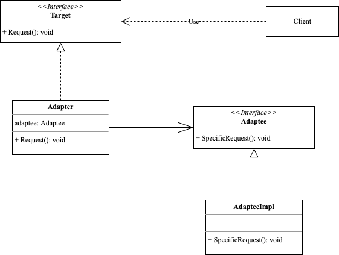

<!-- more -->

## 适配器模式
> 适配器模式(Adapter Pattern)又叫包装器模式：将一个接口转换成客户希望的另一个接口，适配器模式使接口不兼容的那些类可以一起工作

### 角色

- Target: 目标角色，该角色定义是我们期望的接口
- Adapter: 适配器角色，将源角色转换为目标角色
- Adaptee: 源角色

### 优点

- 单一职责原则你可以将接口或数据转换代码从程序主要业务逻辑中分离。
- 满足开闭原则。只要客户端代码通过客户端接口与适配器进行交互，你就能在不修改现有客户端代码的情况下在程序中添加新类型的适配器。

### 缺点

- 代码整体复杂度增加，因为你需要新增一系列接口和类，有时直接更改服务类使其与其他代码兼容会更简单。
