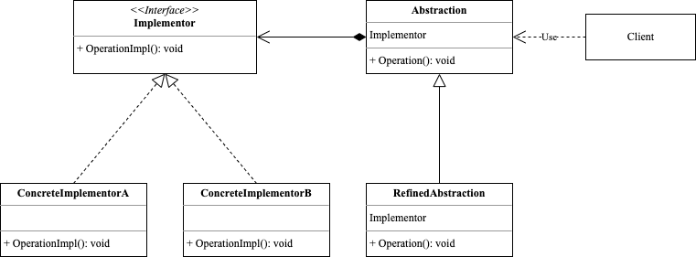

<!-- more -->

[[toc]]

## 某一场景问题

假设某个汽车厂商生产三种品牌的汽车：Big、Tiny和Boss，每种品牌又可以选择燃油、纯电和混合动力。如果用传统的继承来表示各个最终车型，一共有3个抽象类加9个最终子类：

```ascii
                   ┌───────┐
                   │  Car  │
                   └───────┘
                       ▲
    ┌──────────────────┼───────────────────┐
    │                  │                   │
┌───────┐          ┌───────┐          ┌───────┐
│BigCar │          │TinyCar│          │BossCar│
└───────┘          └───────┘          └───────┘
    ▲                  ▲                  ▲
    │                  │                  │
    │ ┌───────────────┐│ ┌───────────────┐│ ┌───────────────┐
    ├─│  BigFuelCar   │├─│  TinyFuelCar  │├─│  BossFuelCar  │
    │ └───────────────┘│ └───────────────┘│ └───────────────┘
    │ ┌───────────────┐│ ┌───────────────┐│ ┌───────────────┐
    ├─│BigElectricCar │├─│TinyElectricCar│├─│BossElectricCar│
    │ └───────────────┘│ └───────────────┘│ └───────────────┘
    │ ┌───────────────┐│ ┌───────────────┐│ ┌───────────────┐
    └─│ BigHybridCar  │└─│ TinyHybridCar │└─│ BossHybridCar │
      └───────────────┘  └───────────────┘  └───────────────┘
```

如果要新增一个品牌，或者加一个新的引擎（比如核动力），那么子类的数量就会爆炸式增长。

## 什么是桥接模式

桥接模式(Bridge Pattern)：是一种结构型设计模式，能将抽象与实现分离，使二者可以各自单独变化而不受对方约束，使用时再将它们组合起来，就像架设桥梁一样链接它们的功能，如此降低了抽象与实现这两个可变维度的耦合度，以保证系统的可扩展性。

桥接模式通过将继承改为组合的方式来解决这个问题，具体来说，就是抽取其中一个维度并使之成为独立的类层次，这样就可以在初始类中引用这个新层次的对象，从而使得一个类不必拥有所有的状态和行为。

### 包含哪些角色



- Abstraction: 抽象部分
  
  提供高层控制逻辑，依赖于完成底层实际工作的视线对象

- RefinedAbstraction: 精确抽象
  
  提供控制逻辑的变体

- Implementor: 实现类接口
  
  为所有具体实现声明通用接口

- ConCreteImplementor: 具体实现类

### 代码示例

```go
package bridge

import "fmt"

type Implementor interface {
	OperationImpl()
}

type ConcreateImplA struct{}

func (ConcreateImplA) OperationImpl() {
	fmt.Println("ConcreateImplA")
}

type ConcreateImplB struct{}

func (ConcreateImplB) OperationImpl() {
	fmt.Println("ConcreateImplB")
}

type Abstraction struct {
	Impl Implementor
}

func (a Abstraction) Operation() {
	fmt.Println("Abstraction")
	a.Impl.OperationImpl()
}

type RefineAbstraction struct {
	Impl Implementor
}

func (ra RefineAbstraction) Operation() {
	fmt.Println("RefineAbstraction")
	ra.Impl.OperationImpl()
}
```

使用示例如下：

```go
package bridge

func ExampleOperation() {
	a := ConcreateImplA{}
	b := ConcreateImplB{}
	abstractA := Abstraction{Impl: a}
	abstractA.Operation()
	abstractB := Abstraction{Impl: b}
	abstractB.Operation()
	refineA := RefineAbstraction{Impl: a}
	refineA.Operation()
	refineB := RefineAbstraction{Impl: b}
	refineB.Operation()
	// Output:
	// Abstraction
	// ConcreateImplA
	// Abstraction
	// ConcreateImplB
	// RefineAbstraction
	// ConcreateImplA
	// RefineAbstraction
	// ConcreateImplB
}
```

## 总结

### 优点

- 抽象与实现分离，扩展能力强
- 符合开闭原则
- 符合合成复用原则
- 实现细节对客户透明

### 缺点

- 由于聚合关系建立在抽象层，要求开发者针对抽象化进行设计与编程，
- 能正确地识别出系统中两个独立变化的维度，这增加了系统的理解与设计难度。