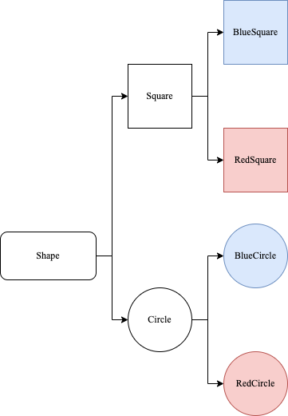

<!-- more -->

[[toc]]

## 场景问题

假设你有一个几何形状类Shape，从它扩展出两个子类：圆形Cicle和方形Square，你希望对这样的类进行扩展使其包含两种颜色：Blue、Red。



很快你会发现，如果新增形状类，例如: 三角形，椭圆形。或者新增颜色，子类的数量将会暴躁式增长。

为了解决这些问题，我们可以用桥接模式来将图形的形状和颜色分离为两个层次结构，让它们可以独立地变化。

## 什么是桥接模式

桥接模式(Bridge Pattern)：是一种结构型设计模式，能将抽象与实现分离，使二者可以各自单独变化而不受对方约束，使用时再将它们组合起来，就像架设桥梁一样链接它们的功能，如此降低了抽象与实现这两个可变维度的耦合度，以保证系统的可扩展性。

桥接模式通过将继承改为组合的方式来解决这个问题，具体来说，就是抽取其中一个维度并使之成为独立的类层次，这样就可以在初始类中引用这个新层次的对象，从而使得一个类不必拥有所有的状态和行为。

### 包含哪些角色


- Abstraction: 抽象角色
  
  定义抽象类，并包含一个对实现对象的引用

- RefinedAbstraction: 扩展抽象角色
  
  抽象角色的子类，实现父类中的业务方法，并通过组合关系调用实现角色中的业务方法。

- Implementor: 实现角色
  
  定义实现类的接口，该接口不一定要与抽象角色的接口完全一致，而是根据实际情况来设计

- ConCreteImplementor: 具体实现角色

  实现角色接口的具体实现

### 代码示例

```go
package bridge

import "fmt"

type Implementor interface {
	OperationImpl()
}

type ConcreateImplA struct{}

func (ConcreateImplA) OperationImpl() {
	fmt.Println("ConcreateImplA")
}

type ConcreateImplB struct{}

func (ConcreateImplB) OperationImpl() {
	fmt.Println("ConcreateImplB")
}

type Abstraction interface {
	Operation()
}

type RefineAbstractionA struct {
	Impl Implementor
}

func (ra RefineAbstractionA) Operation() {
	fmt.Println("RefineAbstractionA")
	ra.Impl.OperationImpl()
}

type RefineAbstractionB struct {
	Impl Implementor
}

func (ra RefineAbstractionB) Operation() {
	fmt.Println("RefineAbstractionB")
	ra.Impl.OperationImpl()
}
```

使用示例如下：

```go
package bridge

func ExampleOperation() {
	a := ConcreateImplA{}
	b := ConcreateImplB{}
	var abstract Abstraction
	abstract = RefineAbstractionA{Impl: a}
	abstract.Operation()
	abstract = RefineAbstractionA{Impl: b}
	abstract.Operation()
	abstract = RefineAbstractionB{Impl: a}
	abstract.Operation()
	abstract = RefineAbstractionB{Impl: b}
	abstract.Operation()
	// Output:
	// RefineAbstractionA
	// ConcreateImplA
	// RefineAbstractionA
	// ConcreateImplB
	// RefineAbstractionB
	// ConcreateImplA
	// RefineAbstractionB
	// ConcreateImplB
}
```

### 解决场景问题

回到本文前面的问题，那么我们如何使用桥接模式解决该问题呢

```go
package shape

import "fmt"

// Implementor
type Color interface {
	GetColor() string
}

// Concrete Implementor
type Red struct{}

func (r Red) GetColor() string {
	return "red"
}

// Concrete Implementor
type Blue struct{}

func (b Blue) GetColor() string {
	return "blue"
}

// Abstraction
type Shape interface {
	Draw()
}

// Refined Abstraction
type Circle struct {
	color Color //组合关系
}

func (c Circle) Draw() {
	fmt.Println(c.color.GetColor() + " circle")
}

// Refined Abstraction
type Square struct {
	color Color //组合关系
}

func (s Square) Draw() {
	fmt.Println(s.color.GetColor() + " square")
}
```

使用示例

```go
package shape

func ExampleBridge() {
	red := Red{}
	blue := Blue{}

	var shape Shape
	shape = Circle{red}
	shape.Draw()
	shape = Circle{blue}
	shape.Draw()
	shape = Square{red}
	shape.Draw()
	shape = Square{blue}
	shape.Draw()
	// Output:
	// red circle
	// blue circle
	// red square
	// blue square
}
```

### 有哪些优缺点

#### 优点

- 实现了抽象和实现部分的分离，从而极大地提高了系统的灵活性，让抽象部分和实现部分独立开来，这有助于系统进行分层设计，从而产生更好的结构化系统。
- 符合开闭原则，抽象部分和实现部分可以分别独立地扩展，而不会相互影响，对系统的修改是通过增加代码进行的，而不是修改原有代码。
- 符合合成复用原则，可以使用不同的实现部分来组合不同的抽象部分，实现更多的功能组合。
- 其实现细节对客户透明，客户只需要关心抽象部分的接口，不用了解具体的实现细节。

#### 缺点

- 增加了系统的理解和设计难度，由于关联关系建立在抽象层，要求开发者一开始就针对抽象层进行设计和编程，能正确地识别出系统中两个独立变化的维度，这增加了系统的复杂性和学习成本。
- 要求正确识别出系统中两个独立变化的维度，因此其使用范围有一定的局限性，如果系统中只有一个变化维度或者两个变化维度之间有很强的耦合关系，那么桥接模式就不适用了。

## 总结

### 桥接设计模式和适配器设计模式的区别

适配器模式是为了复用已有接口的功能，而通过适配将已有接口功能引入到所需接口的一种模式，目的是能够结合。适配器是先定义了新接口，然后才与旧接口进行适配，即先接口后关系。

桥接模式是在一个系统中解决多个维度独立变化的类之间的耦合度问题，先定义了一个桥（即实现和抽象的关系），通过多个实现的不同组合达到其灵活性的目的，即先关系后组合。

- 适配器模式中适配器角色只需要一个，解决两个接口适配问题。
- 桥接模式中扩展抽象角色通常有多个，解决抽象和实现组合爆炸问题。

- 适配器模式中适配者通常只有一个。
- 桥接模式中具体抽象和实现的关系可以有多个，使得多个维度独立变化。
