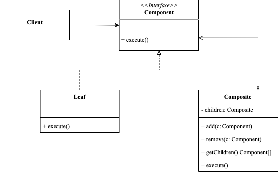

<!-- more -->

## 组合模式
>组合模式（Composite Pattern）：是针对由多个节点对象（部分）组成的树形结构的对象（整体）而发展出的一种结构型设计模式，它能够使客户端在操作整体对象或者其下的每个节点对象时做出统一的响应，保证树形结构对象使用方法的一致性。使客户端不必关注对象的整体或部分，最终达到对象复杂的层次结构与客户端解耦的目的。



### 解决问题
例如：有两类对象：`产品`和`盒子`，`盒子`中可以包含多个`产品`或者小`盒子`，在此基础需要知道这个盒子的总价格，如果直接打开所有的盒子，累加产品的价值，虽然可行。但对计算机会增加许多繁杂的细节。

那么使用组合模式，就可以很好的简化这个细节，如果是`产品`就直接返回价格，如果是`盒子`，则遍历盒子中的所有项目，累加价格。最大的优点，`产品`和`盒子`提供一致的接口，你无需了解内部结构，只需要调用这一个接口即可。

### 角色
- Component: 抽象构件角色，它的主要作用是为树叶构件和树枝构件声明公共接口
- Leaf: 树叶构件角色，组合模式中的叶节点对象，它没有子节点。
- Composite: 树枝构件角色，是组合模式中的分支节点对象，它与子节点。

### 分类

(1) 透明方式：在该方式中，由于抽象构件声明了所有子类中的全部方法，所以客户端无须区别树叶对象和树枝对象，对客户端来说是透明的。但其缺点是：树叶构件本来没有 Add()、Remove() 及 GetChild() 方法，却要实现它们（空实现或抛异常），这样会带来一些安全性问题。

(2) 安全方式：在该方式中，将管理子构件的方法移到树枝构件中，抽象构件和树叶构件没有对子对象的管理方法，这样就避免了上一种方式的安全性问题，但由于叶子和分支有不同的接口，客户端在调用时要知道树叶对象和树枝对象的存在，所以失去了透明性。

### 示例
```go
package composite

import (
	"fmt"
)

type Component interface {
	execute()
}

type Leaf struct{}

func (l *Leaf) execute() {
	fmt.Println("leaf execute")
}

type Composite struct {
	children []Component
}

func (composite *Composite) execute() {
	for _, v := range composite.children {
		v.execute()
	}
}

func (composite *Composite) Add(c Component) {
	composite.children = append(composite.children, c)
}

func (composite *Composite) Remove(c Component) {
	flag := false
	switch c.(type) {
	case *Leaf:
		children := composite.children
		for i, v := range children {
			if value, ok := v.(*Leaf); ok {
				if value == c {
					flag = true
					switch i {
					case 0:
						composite.children = children[1:]
					case len(children) - 1:
						composite.children = children[0 : len(children)-1]
					default:
						composite.children = append(children[:i], children[i+1:]...)
					}
					break
				}
			}
		}
	case *Composite:
		children := composite.children
		for i, v := range children {
			if value, ok := v.(*Composite); ok {
				if value == c {
					flag = true
					switch i {
					case 0:
						composite.children = children[1:]
					case len(children) - 1:
						composite.children = children[0 : len(children)-1]
					default:
						composite.children = append(children[:i], children[i+1:]...)
					}
				}
			}
		}
	}
	if !flag {
		panic("not found")
	}
}

func (composite *Composite) GetChildren() []Component {
	return composite.children
}
```
使用示例
```go
package composite

func ExampleLeaf() {
	var c Component
	l := Leaf{}
	c = &l
	c.execute()
	// Output:
	// leaf execute
}

func ExampleComposite() {
	var c Component
	composite := &Composite{
		children: make([]Component, 0),
	}
	composite.Add(&Leaf{})
	composite.Add(&Leaf{})
	c = composite
	c.execute()
	// Output:
	// leaf execute
	// leaf execute
}
```

### 优点
1. 组合模式使得客户端代码可以一致地处理单个对象和组合对象，无须关心自己处理的是单个对象，还是组合对象，这简化了客户端代码；
2. 更容易在组合体内加入新的对象，客户端不会因为加入了新的对象而更改源代码，满足**开闭原则**；
3. 利用多态和递归机制更昂便地是用复杂树结构；

### 缺点
1. 对于功能差异较大的类，提供公共接口或许会有困难。在特定情况下，需要过度一般化组件接口，使其变得令人难以理解。