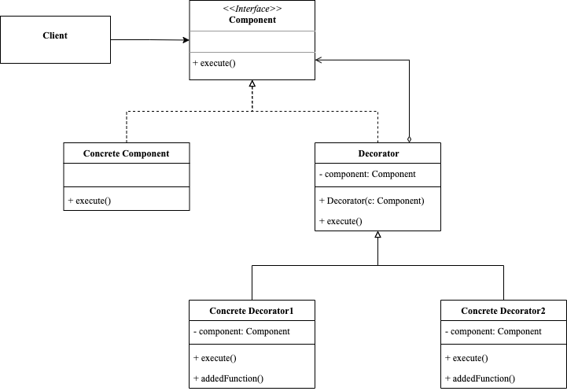

<!-- more -->

## 装饰器模式

> 装饰器模式（Decorator Pattern）：能够在运行时动态地为原始对象增加一些额外的功能，使其变得更加强大。
>
> 装饰器非常类似于**继承**，它们都是为了增强原始对象的功能，区别在于方式的不同，后者是在编译时(compile-time)静态地通过对原始类的继承完成，而前者则是在程序运行时(run-time)通过对原始对象地”包装“完成。



### 角色

- Component: 组件接口，所有被装饰组件及装饰器对应的接口标准；
- ConcreteComponent: 需要被装饰的组件，实现组件接口标准；
- Decorator: 装饰器，装饰器的高层抽象类，同样实现组件接口标准；
- ConcreteDecorator: 装饰器实现，继承自装饰器抽象类的具体子类装饰器，可以有多种实现，在被装饰组件对象的基础上为其添加新的特性。

### 示例

```go
package decorator

import "fmt"

type Component interface {
	execute()
}

type ConcreteComponent struct{}

func (c ConcreteComponent) execute() {
	fmt.Println("concrete component execute")
}

type Decorator struct {
	component Component
}

func (d *Decorator) Decorator(c Component) {
	d.component = c
}

func (d Decorator) execute() {
	d.component.execute()
}

type ConcreteDecortor1 struct {
	Decorator
}

func (c ConcreteDecortor1) addedFunction() {
	fmt.Println("concrete decortor1 add function")
}

func (c ConcreteDecortor1) execute() {
	c.addedFunction()
	c.Decorator.execute()
}

type ConcreteDecortor2 struct {
	Decorator
}

func (c ConcreteDecortor2) addedFunction() {
	fmt.Println("concrete decortor2 add function")
}

func (c ConcreteDecortor2) execute() {
	c.addedFunction()
	c.Decorator.execute()
}
```

使用示例

```go
func ExampleComponent() {
	c := ConcreteComponent{}
	c.execute()
	//c1扩展c的功能
	var c1 ConcreteDecortor1
	c1.Decorator.Decorator(c)
	c1.execute()
	//c2又扩展c1的功能
	var c2 ConcreteDecortor2
	c2.Decorator.Decorator(c1)
	c2.execute()
	// Output:
	// concrete component execute
	// concrete decortor1 add function
	// concrete component execute
	// concrete decortor2 add function
	// concrete decortor1 add function
	// concrete component execute
}
```

### 优点

- 无需创建新子类即可扩展对象的行为
- 可以在运行时添加或删除对象的功能
- 可以用多个装饰封装对象来组合几种行为
- 满足**单一职责原则**，可以将实现不同行为的一个大类拆分为多个较小的类

### 缺点

- 在封装器栈中删除特定封装器比较困难
- 实现行为不受装饰栈顺序影响的装饰比较困困难

### 装饰器设计模式和适配器设计模式之间的区别

相同点：

- 两种设计模式都采用了对象组合的方式，而不是继承。
- 它们都可以在不修改原有代码的基础上，实现新的功能。
- 它们都可以使代码更加灵活，易于扩展和维护。

不同点：

- 装饰器设计模式主要用于添加对象的额外功能，但不改变对象的结构，装饰器本身也可以通过组合和嵌套来实现复杂的功能。而适配器设计模式的主要用途是将不兼容的对象进行转换，它通过适配器来将一个对象转换为另一个对象，以满足特定的需求。
- 装饰器设计模式的关注点在于添加新的功能上，因此装饰器具有可叠加的特性，可以通过一系列的装饰器来逐步添加新的功能。适配器设计模式的关注点在于解决不兼容的问题，因此它只需要一个适配器就能完成转换，不需要添加多个适配器。
- 装饰器设计模式通常应用于对象的实例，比如说为一个对象添加日志、缓存等额外功能。适配器设计模式通常应用于接口或类之间的不兼容问题，比如说将两个不同的接口转换为一个统一的接口。
