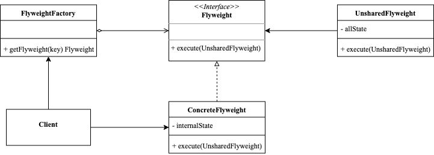

<!-- more -->

## 享元模式

>享元模式（Flyweight Pattern）：有效地支持大量细粒度对象的复用,通过共享已经存在的对象来大幅度减少需要创建的对象数量、避免大量相似类的开销，从而提高系统资源的利用率。

享元对象能做到共享的关键是区分：内蕴状态（Internal State）和外蕴状态（External State），内蕴状态是存储在享元对象内部，并且不会随环境改变而改变，因此可以共享，外蕴状态是随着环境改变而改变，因此不可以共享。



### 角色

- Flyweight: 享元接口，所有元件的高层规范，声明与外蕴状态互动的接口标准。
- ConcreteFlyweight: 享元实现类，自身维护着内蕴状态，且能接受并相应外蕴状态，可以有多个实现。一个享元对象可以被称作一个**元**。
- UnsharedFlyweight: 非享元角色，是不可以共享的外部状态，它以参数的形式注入具体享元的相关方法中
- FlyweightFactory: 享元工厂，用来维护享元对象的工厂，负责对享元对象实例进行创建于管理，并对外提供获取享元对象的服务。
- Client: 客户端，享元的使用者，负责维护外蕴状态。

### 示例

```go
package flyweight

import "fmt"

type UnsharedFlyweight struct {
	ExternalState string
}

type ConcreteFlyweight struct {
	InternalState string
}

func (concrete ConcreteFlyweight) execute(unshared UnsharedFlyweight) {
	fmt.Println(concrete.InternalState)
	fmt.Println(unshared.ExternalState)
}

type Flyweight interface {
	execute(unshared UnsharedFlyweight)
}

type FlyweightFactory struct {
	flyweights map[string]Flyweight
}

func (factory FlyweightFactory) GetFlyweight(key string) Flyweight {
	if flyweight, ok := factory.flyweights[key]; !ok {
		return nil
	} else {
		return flyweight
	}
}
```

使用示例

```go
package flyweight

func ExampleFlyweight() {
	factory := FlyweightFactory{flyweights: map[string]Flyweight{
		"a": ConcreteFlyweight{InternalState: "a"},
		"b": ConcreteFlyweight{InternalState: "bb"},
		"c": ConcreteFlyweight{InternalState: "ccc"},
	}}
	a := factory.GetFlyweight("a")
	a.execute(UnsharedFlyweight{ExternalState: "1"})
	b := factory.GetFlyweight("b")
	b.execute(UnsharedFlyweight{ExternalState: "2"})
	c := factory.GetFlyweight("c")
	c.execute(UnsharedFlyweight{ExternalState: "3"})
	// Output:
	// a
	// 1
	// bb
	// 2
	// ccc
	// 3
}
```

### 优点

1. 享元模式的优点在于它可以极大减少内存中对象的数量，使得相同对象或相似对象在内存中只保存一份。
2. 享元模式的外部状态相对独立，而且不会影响其内部状态，从而使得享元对象可以在不同的环境中被共享。

### 缺点

1. 增加系统复杂性。享元模式需要维护共享对象的状态，增加了代码的复杂度，同时也增加了系统的维护难度。
2. 内部状态和外部状态的区分。享元模式需要区分内部状态和外部状态，内部状态可以被共享，但外部状态必须通过参数传递，增加了对象的可定制性，但也增加了系统的复杂度。

### 总结

享元模式只是一种优化。在应用该模式之前，你要确定程序中存在与大量类似对象同时占用内存相关的内存消耗问题，并且确保该问题无法使用其他更好的方式来解决。
