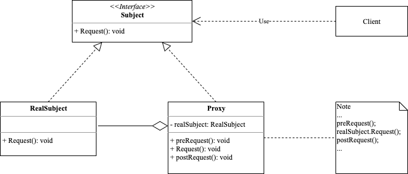

<!-- more -->

[[toc]]

## 什么是代理模式

代理模式(Proxy Pattern):由于某些原因需要给某对象提供一个代理以控制对该对象的访问。这时，访问对象不适合或者不能直接引用目标对象，代理对象作为访问对象和目标对象之间的中介。

### 角色



- Subject: 抽象主题
  
  通过接口或抽象类声明真实主题和代理对象实现的业务方法

- RealSubject: 真实主题
  
  实现了抽象主题中的具体业务，是代理对象所代表的真实对象，是最终要引用的对象

- Proxy: 代理类
  
  提供了与真实主题相同的接口，其内部包含有对真实主题的引用，它可以访问、控制或扩展真实主题的功能。

### 代码示例

```go
package proxy

import "fmt"

type Subject interface {
	Request()
}

type RealSubject struct {
}

func (r RealSubject) Request() {
	fmt.Println("do request")
}

type Proxy struct {
	realSubject Subject
}

func (p *Proxy) preRequest() {
	fmt.Println("pre request")
}

func (p *Proxy) postRequest() {
	fmt.Println("post request")
}

func (p *Proxy) Request() {
	p.preRequest()
	p.realSubject.Request()
	p.postRequest()
}
```

使用示例如下：

```go
package proxy

func ExampleRequest() {
	var subject Subject
	subject = Proxy{realSubject: RealSubject{}}
	subject.Request()
	// Output:
	// pre request
	// do request
	// post request
}
```

## 使用场景

代理设计模式是一种非常常见的设计模式，它通常用于以下场景：

- 远程代理：当一个对象位于不同的地址空间（例如在不同的服务器上）时，为了让客户端能够访问该对象，可以使用远程代理来实现。

- 虚拟代理：当一个对象的创建或者加载时需要很长时间，可以使用虚拟代理来延迟对象的加载或者创建，直到真正需要使用该对象时再进行加载或者创建。

- 安全代理：当对一个对象的访问需要进行安全控制时，可以使用安全代理来控制对象的访问权限，例如在对象被访问时需要进行认证或授权等。

- 缓存代理：当需要缓存一些计算结果时，可以使用缓存代理，以便在后续的访问中直接返回缓存的结果，避免重复计算。

- 日志记录代理：在访问被代理对象的过程中，使用日志记录代理可以记录所有访问记录，以便于问题排查和系统优化等。

### 远程代理

```go
// Subject 接口定义
type Subject interface {
    Request() string
}

// RemoteSubject 结构体实现 Subject 接口
type RemoteSubject struct {
    URL string
}

func (rs *RemoteSubject) Request() string {
    // 远程调用
    response, err := http.Get(rs.URL)
    if err != nil {
        return "Error: " + err.Error()
    }
    defer response.Body.Close()
    body, err := ioutil.ReadAll(response.Body)
    if err != nil {
        return "Error: " + err.Error()
    }
    return string(body)
}

// Proxy 结构体实现 Subject 接口，并在内部包含了一个 RemoteSubject 对象
type Proxy struct {
    subject *RemoteSubject
}

func (p *Proxy) Request() string {
    // 在此处执行一些身份验证、日志记录等操作
    if p.subject == nil {
        p.subject = &RemoteSubject{
            URL: "http://www.example.com",
        }
    }
    return "Proxy -> " + p.subject.Request()
}

// client 代码
func main() {
    var subject Subject = &Proxy{}
    result := subject.Request()
    fmt.Println(result)
}
```

通过这种方式，我们可以将客户端和远程对象之间的耦合度降低，增加了系统的可维护性和可扩展性。

### 虚拟代理

```go
// Image 接口定义
type Image interface {
    Display()
}

// RealImage 结构体实现 Image 接口
type RealImage struct {
    filename string
}

func (ri *RealImage) Display() {
    fmt.Println("Displaying Real Image: ", ri.filename)
}

// Proxy 结构体实现 Image 接口，并在内部包含了一个 RealImage 对象
type Proxy struct {
    image *RealImage
    filename string
}

func (p *Proxy) Display() {
    // 使用虚拟代理，在真正需要使用 RealImage 对象时才进行创建和加载
    if p.image == nil {
        fmt.Println("Creating Real Image: ", p.filename)
        p.image = &RealImage{
            filename: p.filename,
        }
    }
    p.image.Display()
}

// client 代码
func main() {
    var image Image = &Proxy{
        filename: "example.jpg",
    }
    // 第一次调用 Display() 方法会创建和加载 RealImage 对象
    image.Display()
    // 第二次调用 Display() 方法直接使用已创建的 RealImage 对象
    image.Display()
}
```

通过这种方式，我们可以延迟 RealImage 对象的加载或者创建，直到客户端真正需要访问该对象时才进行加载或者创建，从而减少了系统的资源消耗，优化了系统的性能。

### 安全代理

```go
// Subject 接口定义
type Subject interface {
    Request()
}

// RealSubject 结构体实现 Subject 接口
type RealSubject struct {
    // RealSubject 对象需要进行身份认证或者授权等安全处理
    Username string
    Password string
}

func (rs *RealSubject) Request() {
    fmt.Println("Request processed by Real Subject")
}

// Proxy 结构体实现 Subject 接口，并在内部包含了一个 RealSubject 对象
type Proxy struct {
    subject *RealSubject
    username string
    password string
}

func (p *Proxy) Authenticate() bool {
    // 在此处执行身份认证等操作
    if p.username == "admin" && p.password == "admin123" {
        return true
    }
    return false
}

func (p *Proxy) Request() {
    if p.subject == nil {
        p.subject = &RealSubject{
            Username: p.username,
            Password: p.password,
        }
    }
    // 在此处执行授权等操作
    if p.Authenticate() {
        p.subject.Request()
    } else {
        fmt.Println("Authorization failed!")
    }
}

// client 代码
func main() {
    var subject Subject = &Proxy{
        username: "admin",
        password: "admin123",
    }
    subject.Request()
}
```

我们通过认证和授权等操作来控制对 RealSubject 对象的访问权限，只有认证和授权成功之后才能访问 RealSubject 对象，否则返回授权失败的提示消息。通过这种方式，我们可以对系统中的访问进行更加细粒度的控制，增加了系统的安全性和鲁棒性。

### 缓存代理

```go
// Subject 接口定义
type Subject interface {
    Request(arg int) int
}

// RealSubject 结构体实现 Subject 接口
type RealSubject struct{}

func (rs *RealSubject) Request(arg int) int {
    fmt.Println("Processing request with argument:", arg)
    return arg * 2
}

// Proxy 结构体实现 Subject 接口，并在内部包含了一个 RealSubject 对象和一个缓存 map
type Proxy struct {
    subject *RealSubject
    cache map[int]int
}

func (p *Proxy) Request(arg int) int {
    // 尝试从缓存中获取结果
    res, ok := p.cache[arg]
    if ok {
        fmt.Println("Return cached result:", res)
        return res
    }
    // 如果缓存中没有结果，则使用 RealSubject 对象进行计算
    if p.subject == nil {
        p.subject = &RealSubject{}
    }
    res = p.subject.Request(arg)
    // 将计算结果添加到缓存中，并返回结果
    p.cache[arg] = res
    return res
}

// client 代码
func main() {
    var subject Subject = &Proxy{
        cache: make(map[int]int),
    }
    subject.Request(10) // 缓存中没有结果，RealSubject 进行计算并添加到缓存中
    subject.Request(10) // 缓存中存在结果，直接返回缓存结果
}
```

通过这种方式，我们可以减少一些需要重复计算的操作，优化了系统的性能，并且可以快速响应客户端的请求。

### 日志记录代理

```go
// Subject 接口定义
type Subject interface {
    Request()
}

// RealSubject 结构体实现 Subject 接口
type RealSubject struct{}

func (rs *RealSubject) Request() {
    fmt.Println("Processing request...")
}

// Proxy 结构体实现 Subject 接口，并在内部包含了一个 RealSubject 对象和一个日志记录器
type Proxy struct {
    subject *RealSubject
    logger *log.Logger
}

func (p *Proxy) Request() {
    p.logger.Print("Calling Request method...")
    if p.subject == nil {
        p.subject = &RealSubject{}
    }
    p.subject.Request()
    p.logger.Print("Request method finished.")
}

// client 代码
func main() {
    var subject Subject = &Proxy{
        logger: log.New(os.Stdout, "", log.Ldate|log.Ltime),
    }
    subject.Request() // 记录 Request 方法的调用信息和结果信息
}
```

通过这种方式，我们可以在系统中记录每一次对特定对象或方法的调用，以便后续系统调试或问题排查。

## 总结

### 优点

- 代理模式能够协调调用者和被调用者，在一定程度上降低了系统的耦合度
- 远程代理使得客户端可以访问在远程机器上的对象，远程机器坑具有更好的计算性能与处理速度，可以加快相应并处理客户端请求
- 虚拟代理通过使用一个小对象来代表一个大对象，可以减少系统资源的消耗，对系统进行优化并提高运行速度
- **保护代理**可以控制对真实对象的使用权限

### 缺点

- 由于客户端和真实主题之间增加了代理对象，因此有些类型的代理模式可能会造成请求的处理速度变慢
- 实现代理模式需要额外的工作，有些代理模式的实现非常复杂

## 对比

### 代理模式和装饰器模式

代理设计模式和装饰器模式是非常相似的两个模式。

装饰器模式也是一种结构型模式，它允许您向现有对象添加新的功能，而不必改变其结构。代理模式同样也允许您向现有对象添加新的功能，同时也保持原有结构不变。实际上，代理模式就是装饰器模式的一种变体，其核心思想是为了控制访问某个对象，而不是像装饰器模式那样用于扩展对象的功能。

在两种模式中，都需要实现与被代理对象（或被装饰对象）相同的接口。代理模式通过代理对象操纵被代理对象，控制对被代理对象的访问，而装饰器模式则是通过包装器对象来扩展被装饰对象的功能，但对于客户端来说，无论是使用代理对象还是装饰器对象，都是透明的，客户端无法直接感知到代理对象或装饰对象的存在。

总之，代理设计模式和装饰器模式都能够实现动态的扩展对象的功能和控制对象的访问，两者高度相似。代理模式强调的是为了控制访问某个对象，而装饰器模式强调的是为了扩展对象的功能。

### 代理模式和 Middleware

代理设计模式和 Middleware 之间存在相似之处，这两个模式都是为了实现对象间松耦合，增强维护性和扩展性。

相同点：

- 两者都是用于控制系统中各个组件之间的访问和交互。
- 两者都可以在访问和交互时执行额外的操作，例如身份验证、日志记录、路由配置等等。

不同点：

- 代理设计模式通常用于控制客户端和服务端之间的访问，解耦客户端和服务端。而 Middleware 通常用于控制不同层之间的访问和处理，例如日志记录、缓存处理和性能优化等。
- 在代理设计模式中，代理对象需要实现被代理对象相同的接口和方法。而 Middleware 不需要实现任何接口或方法，每个 Middleware 都是独立的，但需要一起协作来处理请求。
