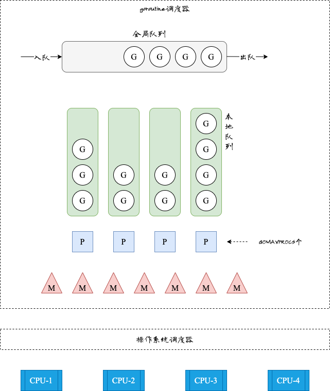

Go语言原生支持并发能力，而goroutine是Go语言原生支持并发的具体实现，本篇将为你揭开goroutine的面纱。

<!-- more -->

## goroutine

goroutine是由Go运行时管理的用户层轻量级线程，相比较操作系统线程，goroutine的资源占用和使用代价都要小的多，一个goroutine初始只需要2KB的内存，而线程需要MB级别的空间，这样在有限的内存空间里，可以创建的goroutine的数量相比较线程数量多的多。其次由于线程切换需要拷贝大量的上下文，这就导致线程切换耗时较高。

## GPM模型

GPM模型中：

- G代表`goroutine`，存储了`goroutine`的执行栈信息、`goroutine`状态及`goroutine`的任务函数等
- P代表`processor`，逻辑处理器，所有的P都在程序启动时创建，P的数量决定了系统内最大可并行的G的数量，最多有`GOMAXPROCS`(可配置)个
- M代表`thread`即用户态线程，M在绑定有效的P后，进入到一个调度循环：从各种队列、P的本地队列获取G，切换到G的执行栈上并执行G的函数，调用`goexit`做清理工作并回到M，如此反复。

此外还有：

- 全局队列(Global Queue)：存放等待运行的G
- P的本地队列(Local Queue)：存放的也是等待运行的G，数量不超过256个。
  - 当G新建goroutine G'时，G'优先加入到P的本地队列(局部性，G和G'相关)
  - 如果本地队列满了，则会把本地队列中的一半G移动到全局队列

## 调度策略

::: tip
其思想：复用线程M，避免频繁的创建、销毁
:::

### work stealing机制

当本地队列无可运行的G时，会尝试从其他P队列中偷取G，而不是销毁M

### hand off机制

当M因为G进行系统调用阻塞时，M会释放绑定的P，此时的M和G都进入阻塞状态

- 如果此时有空闲的M，P会与其绑定并执行剩余的G，
- 如果没有空闲的M，则会创建新的M
  
当系统调用返回后，阻塞在该系统调用的G会尝试获取一个可用的P

- 如果有可用的P，之前运行该G的M将绑定P继续运行G
- 如果没有可用的P，那么G于M之间的关联将解除，同时G会标记为runable，放入全局队列等待调度

::: tip

- 网络I/O不会阻塞M，仅阻塞G
- 文件I/O会阻塞M，这就是为什么大量文件I/O操作会导致大量线程被创建的原因。
:::

### 抢占调度

与操作系统按**时间片**调度线程不同，Go中没有**时间片**的概念。如果某个G没有进行系统调用，没有进行I/O操作、没有阻塞在一个channel操作上，那么**M是如何让G停下来并调度下一个可运行的G呢**？<Badge text="注意" type="warning"/>
答案是：G被抢占调度的

- Go1.2版本在每个函数或方法的入口增加一段额外的代码，让运行时有机会检查是否需要执行抢占调度；（对没有函数调用的G无效）
- Go程序运行时会启动一个名为`sysmon`的M（称为监控线程），该M无须绑定P即可运行（以g0这个G的形式），该M对于长时间运行（超过10ms）的G发出抢占式调度。

## 参考文献

- [文章-Golang调度器GMP原理与调度全分析](https://mp.weixin.qq.com/s/rfjysi-LB-uFiGiZjh-XNw)
- [书籍-Go语言精进之路](https://book.douban.com/subject/35720729/)
