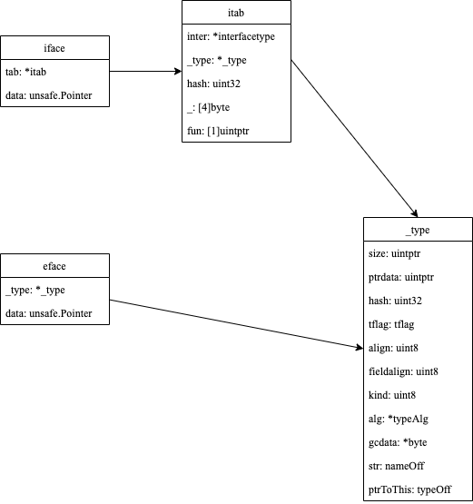

<!-- more -->

[[toc]]

## 接口不为nil的误区

我们看一个demo

```go{30}
package main

import (
	"errors"
	"fmt"
)

type MyError struct {
	error
}

var ErrBad = MyError{
	error: errors.New("bad error"),
}

func bad() bool {
	return false
}

func returnsError() error {
	var p *MyError = nil
	if bad() {
		p = &ErrBad
	}
	return p
}

func main() {
	e := returnsError()
	if e != nil {
		fmt.Printf("error: %+v\n", e)
		return
	}
	fmt.Println("ok")
}
```

::: details 查看运行结果
`error: <nil>`
:::

这里大家很疑惑：明明`returnsError`函数返回的p值为nil，为何却满足了第30行的条件分支？我们先来看看接口类型的底层结构再来回答这个问题。

## 接口类型底层结构

参见`$GOROOT/src/runtime/runtime2.go`



接口类型变量有两种内部表示：

- `eface`：用于表示没有方法的空接口(`empty interface`)类型变量，即`interface{}`类型的变量
- `iface`：用于表示其拥有方法的接口(`interface`)类型变量

`data`都指向当前赋值给接口类型变量的动态类型变量的值，但`iface`相比较`eface`多了`itab`这个类型，其中:

- `inter`存储该接口类型自身的信息
- `_type`存储该接口类型变量
- `fun`存储动态类型已实现的接口方法的调用地址数组

Go运行时会为程序内的全部类型建立只读的共享`_type`信息表，因此如果我们要判断接口类型变量是否相同，只需：

- 判断`_type/tab`是否相同
- `data`指针所指向的内存空间所存储的数据值是否相同

这里需要区分不同的类型之间的等值比较，参见下文

### nil接口变量

未初始化的接口类型变量默认零值为nil

```go
func printNilInterface() {
	// nil接口变量
	var i interface{} // 空接口类型
	var err error     // 非空接口类型
	println(i)
	println(err)
	println("i = nil:", i == nil)
	println("err = nil:", err == nil)
	println("i = err:", i == err)
	println("")
}
```

::: details 查看执行结果

```text
(0x0,0x0)
(0x0,0x0)
i = nil: true
err = nil: true
i = err: true
```

:::
值为nil的接口类型变量内部表示均为`(0x0,0x0)`，即类型信息和数据信息均为空，因此和nil相等

### 空接口类型变量

```go
func printEmptyInterface() {
	// empty接口变量
	var eif1 interface{} // 空接口类型
	var eif2 interface{} // 空接口类型
	var n, m int = 17, 18

	eif1 = n
	eif2 = m

	println("eif1:", eif1)
	println("eif2:", eif2)
	println("eif1 = eif2:", eif1 == eif2)

	eif2 = 17
	println("eif1:", eif1)
	println("eif2:", eif2)
	println("eif1 = eif2:", eif1 == eif2)

	eif2 = int64(17)
	println("eif1:", eif1)
	println("eif2:", eif2)
	println("eif1 = eif2:", eif1 == eif2)

	println("")
}
```

::: details 查看执行结果

```text
eif1: (0x10951e0,0xc000092f68)
eif2: (0x10951e0,0xc000092f60)
eif1 = eif2: false
eif1: (0x10951e0,0xc000092f68)
eif2: (0x10951e0,0x10c64e8)
eif1 = eif2: true
eif1: (0x10951e0,0xc000092f68)
eif2: (0x10952a0,0x10c64e8)
eif1 = eif2: false
```

:::
对于空接口类型变量，只有在`_type`和`data`所指数据内容一致（注意：不是数据指针的值一致）的情况下，两个空接口类型变量之间才能画等号。

### 非空接口类型

```go
type T int

func (t T) Error() string {
	return "bad error"
}

func printNonEmptyInterface() {
	var err1 error // 非空接口类型
	var err2 error // 非空接口类型
	err1 = (*T)(nil)
	println("err1:", err1)
	println("err1 = nil:", err1 == nil)

	err1 = T(5)
	err2 = T(6)
	println("err1:", err1)
	println("err2:", err2)
	println("err1 = err2:", err1 == err2)

	err2 = fmt.Errorf("%d\n", 5)
	println("err1:", err1)
	println("err2:", err2)
	println("err1 = err2:", err1 == err2)

	println("")
}
```

::: details 查看执行结果

```text
err1: (0x10c6a58,0x0)
err1 = nil: false
err1: (0x10c6ab8,0x10c64f0)
err2: (0x10c6ab8,0x10c64f8)
err1 = err2: false
err1: (0x10c6ab8,0x10c64f0)
err2: (0x10c69d8,0xc000096210)
err1 = err2: false
```

:::

针对`err1 = (*T)(nil)`这种赋值，非空接口类型变量的类型信息并不为空，数据指针为空，因此与`nil(0x0,0x0)`不能画等号<Badge text="注意" type="warning"/>
因此文章开头`returnsError`返回的error接口类型变量不为nil也是这个原因。

### 空接口类型和非空接口类型的等值比较

```go{6}
func printEmptyInterfaceAndNonEmptyInterface() {
	var eif interface{} = T(5)
	var err error = T(5)
	println("eif:", eif)
	println("err:", err)
	println("eif = err:", eif == err)

	err = T(6)
	println("eif:", eif)
	println("err:", err)
	println("eif = err:", eif == err)
}
```

::: details 查看执行结构

```text
eif: (0x10974c0,0x10c64f0)
err: (0x10c6ab8,0x10c64f0)
eif = err: true
eif: (0x10974c0,0x10c64f0)
err: (0x10c6ab8,0x10c64f8)
eif = err: false
```

:::

空接口类型变量和非空接口类型变量内部表示的结构不同，但Go进行等值比较时，类型比较使用的是`eface`的`_type`和`iface`的`tab._type`<Badge text="注意" type="warning"/>。因此第6行两者之间是可以画等号的。
