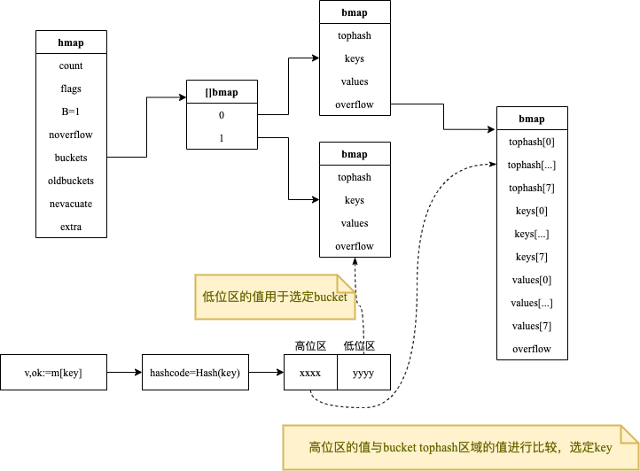
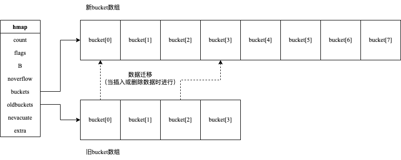

<!-- more -->

> map是Go语言提供的一种抽象数据类型，它表示一组无序的键值对(key-value)

## 声明

**关键字定义**：`map`

**零值**：`nil`

```go
var m map[string]int
```

::: warning
map对于`value`的类型没有限制，但是对`key`的类型有严格的要求：**key的类型必须支持"=="和"!="两个操作符的数据类型**，因此：函数、map、切片不能作为key类型。
:::

::: warning
向`nil`（未初始化）的map类型里添加数据会导致`panic`<Badge text="注意" type="warning"/>
:::

## 初始化

- 字面量初始化

  ```go
  m:=map[string]int{"apple":2,"banana":3}
  ```

- 内置函数make()初始化

  ```go
  m:=make(map[string]int,10)
  ```

## 操作

```go
package main

import "fmt"

func main() {
	m := make(map[string]int, 10)
	m["apple"] = 1       //新增
	m["apple"] = 2       //修改
	delete(m, "apple")   //删除
	v, ok := m["banana"] //comma ok 查询
	if ok {
		fmt.Println(v)
	}
	fmt.Println(len(m))   //获取key的个数
	for k, v := range m { //遍历m
		fmt.Println(k, v)
	}
}
```

:eyes:

- 删除不存在的key不会导致panic；
- 查询不存在的key，如果未使用**comma ok**语法，则会返回value类型对应的零值

## 底层原理

参见`$GOROOT/src/runtime/map.go`

### map的数据结构

```go
type hmap struct {
	count      int            //当前保存的元素个数
	flags      uint8          //当前map所处的状态标志
	B          uint8          //bucket数组的大小的对数：2^B=bucket数量
	noverflow  uint16         //overflow buckets的大约数量
	hash0      uint32         //hash函数的种子值
	buckets    unsafe.Pointer //指向bucket数组的指针
	oldbuckets unsafe.Pointer //在map扩容阶段指向前一个bucket数组的指针
	nevacuate  uintptr        //map扩容阶段充当扩容进度计数器,小于此bucket都已完成了数据排空和迁移操作
	extra      *mapextra      //可选字段，与gc相关
}
```

### bucket的数据结构

```go
// a bucket for a Go map
type bmap struct {
	tophash [bucketCnt]uint8
}

// 实际上编辑期间会动态生产一个新的结构体
type bmap struct {
	tophash  [8]uint8
	keys     [8]keytype
	values   [8]valuetype
	overflow uintptr
}
```



key和value分开存储，目的是为了减少内存对齐带来的内存浪费，以map[int8]int64为例：


每个bucket可以存储8个键值对，超过就会创建一个新的bucket，通过overflow链接

当有两个或以上数量的键被`Hash`到了同一个bucket时，我们称这些键发生了冲突，Go语言使用链表解决键冲突。

hash冲突并不是好事情，它降低了存取效率，好的Hash算法可以保证Hash值得随机性，但无论使用哪种Hash算法，冲突终究不可避免，当冲突较多的时候就需要采取一些措施来减少冲突。

### 负载因子LoadFactor

> 负载因子用于衡量一个Hash表的冲突情况，计算公式如下：
>
> 负载因子 = 键数量 / bucket数量

- 负载因子过小，空间利用率低；
- 负载因子过大，说明冲突严重，存取效率低；

当Hash表的负载因子过大时需要rehash，即申请更多的bucket，并对所有的键值对重新组织，使其均匀的分布在这些bucket中。

- redis的负载因子大于1时就会触发rehash；
- go的负载因子大于6.5时才会触发rehash；

### 扩容

条件：

- 负载因子大于6.5时
- overflow的数量大于2^15=32768

map的扩缩容的主要区别在于hmap.B的容量大小改变，而缩容由于hmap.B压根不变，内存占用依然存在。这就导致在删除元素时，并不会释放内存，使得分配的总内存不断增加，如果不注意，内存就很容易爆了。<Badge text="注意" type="warning"/>
[](https://eddycjy.com/posts/go/map-reset/)

#### 增量扩容

> 通过将bucket数组扩大一倍实现，并搬迁键值对

1. oldbuckets指向现有bucket数组；
2. 创建一个两倍现有规模的bucket数组；
3. buckets指向新的bucket数组；
4. 将oldbuckets的键值对搬迁到新的bucket数组；
5. 释放oldbuckets；


#### 等量扩容

> 用于解决一个bucket链接很多bucket，overflow数量过高
>
> bucket数组大小不变，重新排列键值对，分散到不同的bucket数组中

### 增删改查

#### 查找过程

- 根据key计算hash值；
- 取hash值低位与hmap.B取模来确定bucket的位置；
- 取hash值高位，在tophash数组中查询；
- 如果tophash[i]中存储的hash值与当前key的hash值相等，则获取tophash[i]的key值进行比较；
- 当前bucket没有找到，则依次从溢出的bucket中查找；
::: tip
如果当前map处于搬迁过程中，那么查找时从oldbuckets数组中查找，不再从新的buckets数组中查找
:::

#### 添加过程

- 根据key计算hash值；
- 取hash值低位与hmap.B取模来确定bucket的位置；
- 查找该key是否存在
  - 如果存在，则直接更新；
  - 如果不存在，则从该bucket中寻找空余位置并插入；

::: tip
如果当前map处于搬迁过程中，那么直接添加到新的buckets数组中
:::

#### 删除过程

- 查找key是否存在
  - 存在，则删除；
  - 不存在，则什么也不做；

## map注意事项

### 非并发读写安全的

```go
package main

import (
	"fmt"
	"time"
)

func doIteration(m map[int]int) {
	for k, v := range m {
		_ = fmt.Sprintf("[%d, %d] ", k, v)
	}
}
func doWrite(m map[int]int) {
	for k, v := range m {
		m[k] = v + 1
	}
}

func main() {
	m := map[int]int{
		1: 11,
		2: 12,
		3: 13,
	}

	go func() {
		for i := 0; i < 1000; i++ {
			doIteration(m)
		}
	}()

	go func() {
		for i := 0; i < 1000; i++ {
			doWrite(m)
		}
	}()

	time.Sleep(5 * time.Second)
}
```

运行报错：`fatal error: concurrent map iteration and map write`
Go原生map是非并发安全的，Go 1.9版本中引入支持并发写安全的`sync.Map`类型

### 无法通过索引直接获取value的地址

```go{15}
package main

import "fmt"

type Num struct {
	id int
}

func main() {
	m := make(map[int]Num)
	m[0] = Num{0}
	value := m[0]
	fmt.Println(value)
	fmt.Println(&value)
	fmt.Println(&m[0])  //invalid operation: cannot take address of m[0] (map index expression of type Num)
}
```

这是由于map可以自动扩容，map中的数据元素的value位置可能在这过程中发生变化，这个约束在编译期间就生效。

### 尽量使用cap参数初始化map

```go
package main

import "testing"

const size = 10000

func BenchmarkMapInitWithoutCap(b *testing.B) {
	for n := 0; n < b.N; n++ {
		m := make(map[int]int)
		for i := 0; i < size; i++ {
			m[i] = i
		}
	}
}

func BenchmarkMapInitWithCap(b *testing.B) {
	for n := 0; n < b.N; n++ {
		m := make(map[int]int, size)
		for i := 0; i < size; i++ {
			m[i] = i
		}
	}
}
```

性能基准测试结果如下：

```text
go test -benchmem -bench=. cap_benchmark_test.go           
goos: darwin
goarch: amd64
cpu: Intel(R) Core(TM) i5-8259U CPU @ 2.30GHz
BenchmarkMapInitWithoutCap-8        1226           1338887 ns/op          687175 B/op        276 allocs/op
BenchmarkMapInitWithCap-8           2534            425859 ns/op          322225 B/op         11 allocs/op
PASS
ok      command-line-arguments  5.939s
```
