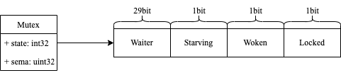
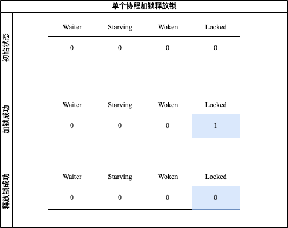
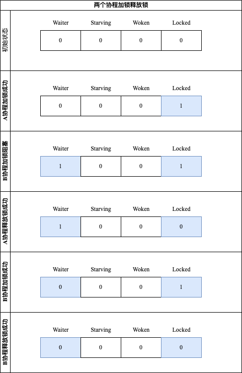
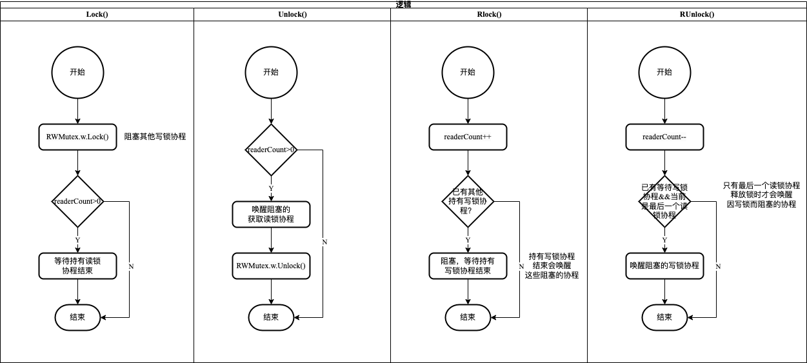

Go语言sync包提供了两种锁：

- 互斥锁 Mutex:
  - 加锁时，其他加锁协程均阻塞
- 读写锁 RWMutex:
  - 加读锁时，加写锁协程阻塞，加读锁协程不阻塞
  - 加写锁时，其他加读写协程均阻塞

<!-- more -->

[[toc]]

## 互斥锁 Mutex

### Mutex数据结构

参见`$GOROOT/src/sync/mutex.go`

```go
type Mutex struct{
  state int32
  sema  uint32
}
```

其中：

- state: 表示互斥锁的状态，比如是否被锁定等；
- sema: 表示信号量，协程阻塞等待该信号量，解锁的协程释放信号量从而唤醒等待信号量的协程；

Mutex.state虽然是`int32`数据类型，内部实现时把该变量分成四份，用于记录Mutex的四种状态



- Locked: 表示该Mutex是否已被锁定，0表示没有锁定，1表示已锁定
- Woken: 表示是否协程已被唤醒，0表示没有协程唤醒，1表示已有协程唤醒
- Starving: 表示该Mutex是否处于饥饿状态，0表示没有饥饿，1表示饥饿状态（说明已有协程阻塞时间超过1ms）
- Waiter: 表示阻塞等待协程的个数，协程解锁时根据此值来判断是否需要释放信号量

### Mutex的方法

Mutex对外提供两个方法：

- Lock(): 加锁方法
- Unlock(): 解锁方法

#### 单个协程的加锁释放过程

Mutex内部`state`表示如下：



#### 两个协程的加锁释放过程

Mutex内部`state`表示如下：



上面介绍Mutex加锁和解锁只使用内部`state`标记：`Waiter`和`Locked`两个，另外两个标记就不得不提自旋过程了。

### 自旋过程

> 自旋过程是：加锁时，如果当前`Locked`为1，则说明当前该锁由其他协程持有，尝试加锁的协程并不是马上转入阻塞，而是会持续地探测`Locked`是否变为0，这个过程就是自旋过程。
>

::: details 自旋的条件

- 自旋次数要足够少，通常为4；
- CPU核数要大于1，否则自旋没有意义，因为此时不可能有其他协程释放锁；
- 协程调度GMP中的P的数量要大于1；
- 协程调度运行队列必须为空，否则会延迟协程调度；
:::

::: tip
自旋的好处：当加锁失败时不必立即转入阻塞，有一定机会获得锁，避免协程的切换。
:::

自旋的时间很短，如果自旋过程中发现锁已被释放，那么协程可以立即获取锁，此时即便有其他协程被唤醒也无法获取锁，只能再次阻塞。

如果自旋过程中获得锁，那么之前被阻塞的协程将无法获得锁，之前阻塞的协程一直获取不到锁（超过1ms）将进入**饥饿**状态<Badge text="注意" type="warning"/>。为了避免这个问题，Go1.8版本Mutex增加新的状态`Starving`，这个状态下不会自旋，一旦协程释放锁，就会唤醒一个等待加锁协程。

如果此时有两个协程，一个在加锁，另一个在解锁，在加锁的过程中可能处于自旋，此时会把`Woken`标记为1，用于告知解锁协程，不必释放信号量，它很快会拿到锁。

### Mutex注意事项

::: danger
Mutex等sync中定义的结构类型首次使用后不应对其进行复制操作
:::

我们看一个示例：

```go
package main

import (
	"log"
	"sync"
	"time"
)

type foo struct {
	n int
	sync.Mutex
}

func main() {
	f := foo{n: 17}

	go func(f foo) {
		for {
			log.Println("g2: try to lock foo...")
			f.Lock()
			log.Println("g2: lock foo ok")
			time.Sleep(3 * time.Second)
			f.Unlock()
			log.Println("g2: unlock foo ok")
		}
	}(f)

	f.Lock()
	log.Println("g1: lock foo ok")

	// 在mutex首次使用后复制其值
	go func(f foo) {
		for {
			log.Println("g3: try to lock foo...")
			f.Lock()
			log.Println("g3: lock foo ok")
			time.Sleep(5 * time.Second)
			f.Unlock()
			log.Println("g3: unlock foo ok")
		}
	}(f)

	time.Sleep(1000 * time.Second)
	f.Unlock()
	log.Println("g1: unlock foo ok")
}
```

::: details 查看执行结果
```
2023/03/12 19:23:45 g1: lock foo ok
2023/03/12 19:23:45 g2: try to lock foo...
2023/03/12 19:23:45 g3: try to lock foo...
2023/03/12 19:23:45 g2: lock foo ok
2023/03/12 19:23:48 g2: unlock foo ok
2023/03/12 19:23:48 g2: try to lock foo...
2023/03/12 19:23:48 g2: lock foo ok
2023/03/12 19:23:51 g2: unlock foo ok
...
```
我们看到g3在加锁操作之后阻塞，而g2按照预期正常运行

g2和g3的区别在于：

- g2是在互斥锁首次使用之前创建
- g3是在互斥锁执行完加锁操作之后创建，并且在创建g3的时候复制了foo实例
:::

sync包中类型的实例在被复制得到的副本后将脱离原实例的控制范围，因此推荐传指针的方式<Badge text="注意" type="warning"/>，保证使用的锁是同一实例。

## 读写锁 RWMutex

### RWMutex数据结构

参见`$GOROOT/src/sync/mutex.go`

```go
type RWMutex struct{
  w           Mutex
  writerSem   uint32
  readerSem   uint32
  readerCount int32
  readerWait  int32
}
```

其中：

- w: 用于控制多个写锁，获得写锁首先要获取该锁
- writerSem: 写阻塞的协程等待的信号量，最后一个读协程释放锁时会释放信号量
- readerSem: 读阻塞的协程等待的信号量，持有写锁的协程释放锁后会释放信号量
- readerCount: 记录读协程的个数
- readerWait: 记录写阻塞时的读协程个数

### RWMutex的方法

- RLock(): 加读锁
  - 增加读操作计数，即readerCount++
  - 如果已经有持有写锁协程，则阻塞自己
- RUnlock(): 释放读锁
  - 减少读操作计数，即readerCount--
  - 如果有阻塞的写锁协程，则唤醒它
- Lock(): 加写锁
  - 获取互斥锁
  - 如果持有读锁协程，则阻塞自己，等待所有的读操作结束
- Unlock(): 释放写锁
  - 释放互斥锁
  - 如果其他阻塞的读锁协程，则唤醒它



### RWMutex的细节分析

#### 写操作是如何阻止写操作的？

读写锁RWMutex包含一个互斥锁w，获取写锁必须先获取该互斥锁，如果互斥锁已被其他协程持有，则只能阻塞等待。

#### 写操作是如何阻止读操作的？

读写锁RWMutex包含当前读协程数量readerCount，每次获取读锁则加1，每次释放读锁则减1，因此取值为[0,N],N最大为2e30。
当获取写锁时，会将readerCount减去2e30，变成了负值。获取读锁协程检测到readerCount为负值，便知道正在加写锁，只好阻塞自己。
真实的readerCount不会丢失，只需要加2e30即可。

#### 读操作是如何阻止写操作的？

读锁会先将RWMutex.readerCount加1，写锁协程检测到readerCount不为0，则会阻塞自己。

#### 写锁为什么不会被**饿死**？

获取写锁期间，可能还有其他协程获取读锁，如果写锁一直等待所有的读操作结束，则很可能被**饿死**，RWMutex通过readerWait解决这个问题，当获取写锁时，会把readerCount复制到readerWait，用于标记排在写操作前面的读操作个数，读操作结束会递减readerCount的值，同时也会递减readerWait的值，当readerWait值为0时唤醒写操作。写操作结束后才会唤醒其他的读操作。

## 参考资料

[Go专家编程](https://book.douban.com/subject/35144587/)