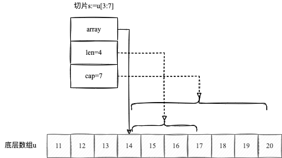
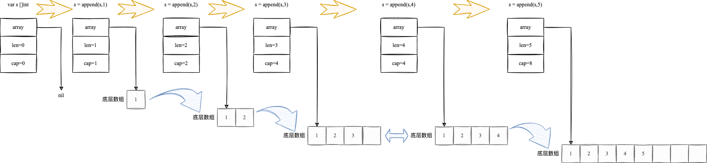

<!-- more -->

[[toc]]

> 切片（slice）简称动态数组，既然是动态，切片的长度可以动态伸缩。

在Go语言编程过程中，我经常使用切片而非数组，因为切片相比较数组更加**灵活**和**高效**。
## 声明

```go
var (
		a []int               // 指针为nil，len和cap为0
		b = []int{}           // 空切片，不等于nil，表示空的集合
		c = []int{1, 2, 3}    // 指向包含三个元素的数组：[1，2，3]。len和cap为3
		d = c[:2]             // 与c指向同一个数组，但是len为2，cap为3
		e = c[0:2:cap(c)]     // 与c指向同一个数组，但是len为2，cap为cap(c)的大小，即3
		f = c[:0]             // 与c指向同一个数组，但是len为0，cap为3
		g = make([]int, 3)    // 指向新的数组，包含三个元素：[0,0,0]。len和cap为3
		h = make([]int, 2, 3) // 指向新的数组，包含三个元素：[0,0,0]。len为2，cap为3
		i = make([]int, 0, 3) // 指向新的数组，包含三个元素：[0,0,0]。len为0，cap为3
	)
```

:eyes:<Badge text="注意" type="warning"/>

::: danger 切片声明时未初始化，此时不能对切片进行索引操作!
```go
var a []int
a[0] = 1 //panic: runtime error: index out of range [0] with length 0
```
:::
但是
::: tip append可以对未初始化的切片进行操作，因为append操作会对底层数据进行扩容。
```go
var a []int
a = append(a, 1) //正常
```
:::

## 底层结构
切片的结构定义：`$GOROOT/src/runtime/slice.go`

```go
type slice struct {
	array unsafe.Pointer
	len   int
	cap   int
}
```

切片的定义包含三个字段：
- **array**：指向数组某元素的指针（该元素也是切片的起始元素）；
- **len**：表示切片的长度，即切片当前元素的个数；
- **cap**：表示切片的最大容量；

::: tip 切片与数组在函数参数传递中比较
- 切片作为函数参数传递给函数时，实际传递的是runtime.slice结构体实例，无论其底层数据有多大，参数传递带来的性能损耗都是很小且恒定的。
- 数组作为函数参数传递给函数时就不一样了，会重新拷贝整个数组，性能损耗就很大。
:::

既然我们已经知道切片的底层结构是数组，那么我们就可以基于数组创建切片
```go
u := [10]byte{11, 12, 13, 14, 15, 16, 17, 18, 19, 20}
s := u[3:7]
fmt.Println(s, len(s), cap(s))  //[14 15 16 17] 4 7
```


::: warning
如果多个切片共用同一个底层数组,某个切片的操作对其他切片都是**可见的**<Badge text="注意" type="warning"/>
:::

## Append扩容原理
```go
var s []int
fmt.Println(len(s), cap(s)) // 0 0
s = append(s, 1)
fmt.Println(len(s), cap(s)) // 1 1
s = append(s, 2)
fmt.Println(len(s), cap(s))	// 2 2
s = append(s, 3)
fmt.Println(len(s), cap(s)) // 3 4
s = append(s, 4)
fmt.Println(len(s), cap(s)) // 4 4
s = append(s, 5)
fmt.Println(len(s), cap(s)) // 5 8
```
其执行逻辑如下图所示：



::: warning
Append在当前数组容量无法满足时，会分配新的数组，新的数组容量会按一定的算法扩展（参见`$GOROOT/src/runtime/slice.go`的`growslice`函数），将旧数组中的数据复制到新数组之后，切片array指针指向新的数组，之后旧的数组就如果未被使用或其他切片引用会被垃圾回收掉。
:::

::: danger 
一旦底层数组容量无法满足某个切片的容量需求，该切片与底层数组关系就会**解除绑定**<Badge text="注意" type="warning"/>
:::
```go {6,15}
package main

import "fmt"

func SliceRise(s []int) {
	s = append(s, 0)
	for i := range s {
		s[i]++
	}
}

func main() {
	s1 := []int{1, 2}
	s2 := s1
	s2 = append(s2, 3)
	SliceRise(s1)
	SliceRise(s2)
	fmt.Println(s1, len(s1), cap(s1)) //s1:[1,2]
	fmt.Println(s2, len(s2), cap(s2)) //s2:[2,3,4,0]
}
```
- 第15行，由于s2需要的存储空间超过s1的存储空间，因此重新申请了一块空间，至此s1和s2不再共享同一底层数组；
- `SliceRise`函数第一步，进行扩容，由于s1传参的底层数组不满足存储空间，因此s切片和s1将不再共享同一空间，然而s2传参的底层数组满足存储空间，因此s切片和s2共享底层数据，因此对s切片的操作会影响到底层数据，进行影响s2；

append扩容会重新分配底层数组并复制元素，当元素较多时，操作代价还是很大的。避免这种场景的方法是对切片的容量规模进行预估，并以cap参数的形式进行创建：`s:=make([]T, len, cap)`

我们将未预估容量的append操作与预估容量的append操作进行压测如下：
```go
package main

import (
	"testing"
)

const size = 10000

func BenchmarkSliceInitWithoutCap(b *testing.B) {
	for n := 0; n < b.N; n++ {
		s1 := make([]int, 0)
		for i := 0; i < size; i++ {
			s1 = append(s1, i)
		}
	}
}

func BenchmarkSliceInitWithCap(b *testing.B) {
	for n := 0; n < b.N; n++ {
		s1 := make([]int, 0, size)
		for i := 0; i < size; i++ {
			s1 = append(s1, i)
		}
	}
}
```
其结果如下：
```
go test -benchmem -bench=. cap_benchmark_test.go 
goos: darwin
goarch: amd64
cpu: Intel(R) Core(TM) i5-8259U CPU @ 2.30GHz
BenchmarkSliceInitWithoutCap-8             18600             62965 ns/op          357625 B/op         19 allocs/op
BenchmarkSliceInitWithCap-8                71695             15997 ns/op           81920 B/op          1 allocs/op
PASS
ok      command-line-arguments  3.630s
```
- 不带cap的append操作的平均性能是62965 ns/op，是带cap的append操作的`4`倍左右；
- 不带cap的append操作每次操作分配357625B内存，而带cap的append操作仅分配81920B；
- 不带cap的append操作平均每次分配19次内存，而带cap的append操作仅需一次内存分配；

## Append操作

和数组类似，可以使用`len()`和`cap()`函数获取切片的长度和容量。此外可以使用`append()`对切片追加元素，但`append()`远不止这个功能。

### 添加切片元素

#### 在切片尾部追加元素

```go
var a []int                      //指针为nil，len和cap为0
a = append(a, 1)                 //追加一个元素，len和cap都为1
a = append(a, 2, 3, 4)           //追加三个元素，len和cap都为4
a = append(a, []int{5, 6, 7}...) //追加一个切片，len为7，cap为8
fmt.Println(a)                   //[1 2 3 4 5 6 7]
```

#### 在切片头部追加元素

```go
var a = []int{1, 2, 3}              //len和cap都为3
a = append([]int{0}, a...)          //在开头添加一个元素，len和cap都为4
a = append([]int{-3, -2, -1}, a...) //在开头添加一个切片，len为7，cap为8
fmt.Println(a)                      //[-3 -2 -1 0 1 2 3]
```

在切片开头追加元素会导致内存的重新分配，已有的元素会复制一份。因此从切片的头部追加元素的性能很差，也很少使用到。

#### 在切片中间追加元素

```go
var a = []int{1, 2, 7}
a = append(a[:2], append([]int{3}, a[2:]...)...)       //追加一个元素，现在包含元素[1,2,3,7]
a = append(a[:3], append([]int{4, 5, 6}, a[3:]...)...) //追加一个切片，现在包含元素[1,2,3,4,5,6,7]
fmt.Println(a)                                         //[1 2 3 4 5 6 7]
```

同样，在切片中间追加元素，会创建许多临时切片，性能比较差。可以使用`copy()`函数完成类似的功能：

```go
var a = []int{1, 2, 4}         // [1,2,4],cap=3
a = append(a, 0)               // [1,2,4,0],cap=6
copy(a[3:], a[2:])             // [1,2,0,4],cap=6
a[2] = 3                       // [1,2,3,4],cap=6
fmt.Println(a, len(a), cap(a)) //[1 2 3 4] 4 6
```

`copy(target,source)`函数，将source的内容复制到target，相比较append，节省了临时切片的创建。

### 删除切片元素

#### 在切片头部删除元素

```go
var a = []int{1, 2, 3}         // [1,2,3],len=3,cap=3
a = append([]int{}, a[1:]...)  // [2,3],len=2,cap=2
fmt.Println(a, len(a), cap(a)) //[2 3] 2 2
```
这里的len和cap都为2，是因为重新分配了内存空间

#### 在切片中部删除元素

```go
var a = []int{1, 2, 3, 4}      // [1,2,3,4],len=4,cap=4
a = append(a[:1], a[2:]...)    // [1,3,4],len=3,cap=4
fmt.Println(a, len(a), cap(a)) //[1 3 4] 3 4
```

#### 在切片尾部删除元素

```go
var a = []int{1, 2, 3}         // [1,2,3],len=3,cap=3
a = a[:2]                      // [1,2],len=2,cap=3
fmt.Println(a, len(a), cap(a)) //[1 2] 2 3
```

#### 删除尾部一个元素

```go
a = a[:len(a)-1]
```

#### 删除尾部N个元素

```go
a = a[:len(a)-N]
```