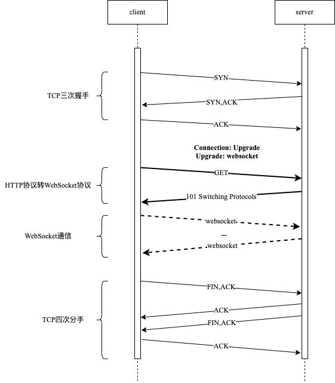

> WebSocket是为了提供web应用程序和服务端全双工通信而专门定制的一种网络协议，和HTTP协议一样位于OSI模型的应用层协议。

## 特点

- 建立在TCP协议之上
- 与HTTP协议有着良好的兼容性，握手阶段采用HTTP协议，默认端口是80和443
- 数据格式比较轻量，性能开销小、通信高效
- 可以发送文本，也可以发送二进制数据
- 没有同源限制，客户端可以与任意服务器通信
- 协议标识符是ws(如果加密，则为wss)，形式：ws://echo.websocket.org

## 交互时序



## 抓包分析

### HTTP请求

```text
GET /ws hTTP/1.1
Host: localhost:2021
Upgrade: websocket
Connection: Upgrade
Sec-Websocket-Key: mViTimINUhcF0fBHeX+wqA==
Sec-Websocket-Version: 13
```

- `Connection: Upgrade`表明要升级协议
- `Upgrade:  websocket`表明升级至websocket协议
- `Sec-Websocket-Key`是客户端发送的一个base64编码的秘文，要求服务端返回一个对应加密的`Sec-Websocket-Accept`应答，否则客户端会抛出“Error during WebSocket handshake”错误，并关闭连接
- `Sec-Websocket-Version: 13`表示 websocket的版本，如果服务端不支持该版本，需要返回一个Sec-Websocket-Version里面包含服务端支持的版本号

### HTTP返回

```text
HTTP/1.1 101 Switching Protocols
Connection: Upgrade
Upgrade: websocket
Sec-Websocket-Accept: YLcYR/p/mS8hENqlgMXtFTggdv8=
```

- Sec-Websocket-Accept是服务端采用与客户端一致的秘钥计算出来后返回客户端，计算公式

> toBase64(sha1(Sec-WebSocket-Key + 258EAFA5-E914-47DA-95CA-C5AB0DC85B11))

- `HTTP/1.1 101 Switching Protocols`表示服务端接受WebSocket协议的客户端连接

## 数据帧格式

> 从左到右，单位是比特。比如`FIN`、`RSV1`、`RSV2`、`RSV3`各占据1比特，`opcode`占据4比特
>
> 内容包括了标识、操作代码、掩码、数据长度

```text
  0                   1                   2                   3
  0 1 2 3 4 5 6 7 8 9 0 1 2 3 4 5 6 7 8 9 0 1 2 3 4 5 6 7 8 9 0 1
 +-+-+-+-+-------+-+-------------+-------------------------------+
 |F|R|R|R| opcode|M| Payload len |    Extended payload length    |
 |I|S|S|S|  (4)  |A|     (7)     |             (16/64)           |
 |N|V|V|V|       |S|             |   (if payload len==126/127)   |
 | |1|2|3|       |K|             |                               |
 +-+-+-+-+-------+-+-------------+ - - - - - - - - - - - - - - - +
 |     Extended payload length continued, if payload len == 127  |
 + - - - - - - - - - - - - - - - +-------------------------------+
 |                               |Masking-key, if MASK set to 1  |
 +-------------------------------+-------------------------------+
 | Masking-key (continued)       |          Payload Data         |
 +-------------------------------- - - - - - - - - - - - - - - - +
 :                     Payload Data continued ...                :
 + - - - - - - - - - - - - - - - - - - - - - - - - - - - - - - - +
 |                     Payload Data continued ...                |
 +---------------------------------------------------------------+
```

- `FIN`：1个比特

  - 如果是1：表示这是消息的最后一个分片；

  - 如果是0：标识这不是消息的最后一个分片；

- `RSV1`、`RSV2`、`RSV3`：各占1个比特

  - 一般情况下全为0，当客户端、服务端协商采用websocket扩展时，这三个标志位可以非0，且值得含义由扩展进行定义；

  - 如果出现非零的值，且并没有采用websocket扩展，连接出错

- `Opcode`：4个比特

  - %x0：表示一个延续帧。当Opcode为0时，表示本次数据传输采用了数据分片，当前收到的数据帧为其中一个数据分片。
  - %x1：表示这是一个文本帧（frame）
  - %x2：表示这是一个二进制帧（frame）
  - %x3-7：保留的操作代码，用于后续定义的非控制帧。
  - %x8：表示连接断开。
  - %x9：表示这是一个ping操作。
  - %xA：表示这是一个pong操作。
  - %xB-F：保留的操作代码，用于后续定义的控制帧。

- `Mask`：1个比特

  > 表示是否要对数据载荷进行掩码操作
  >
  > - 从客户端向服务端发送数据时，需要对数据进行掩码操作；
  > - 从服务端向客户端发送数据时，不需要对数据进行掩码操作；
  >
  > 如果服务端接收到的数据没有进行掩码操作，服务端需要断开连接
  >
  > 如果Mask是1，那么Masking-key中会定义一个掩码键，并用这个掩码键对数据载荷进行反掩码。

- `Payload length`：数据载荷的长度，单位是字节。为7位、或2✖️8位，或8✖️8位

  - [0,126)：数据的长度就是Payload length的大小；
  - 126：后续2个字节为数据的长度；
  - 127：后续8个字节为数据的长度；

- `Masking-key`：0或4字节

  - `Mask`为1，则包含4字节的`Masking-key`
  - `Mask`为0，则不包含`Masking-key`

- `Payload data`：扩展数据+应用数据

  - 如果没有协商使用扩展的话，扩展数据为0字节；
  - 所有的扩展都必须声明扩展数据的长度，扩展如何使用必须在握手阶段就协商好；

## 参考链接

[新手快速入门：WebSocket简明教程](http://www.52im.net/thread-831-1-1.html)

[WebSocket协议：5分钟从入门到精通](https://www.cnblogs.com/chyingp/p/websocket-deep-in.html)
