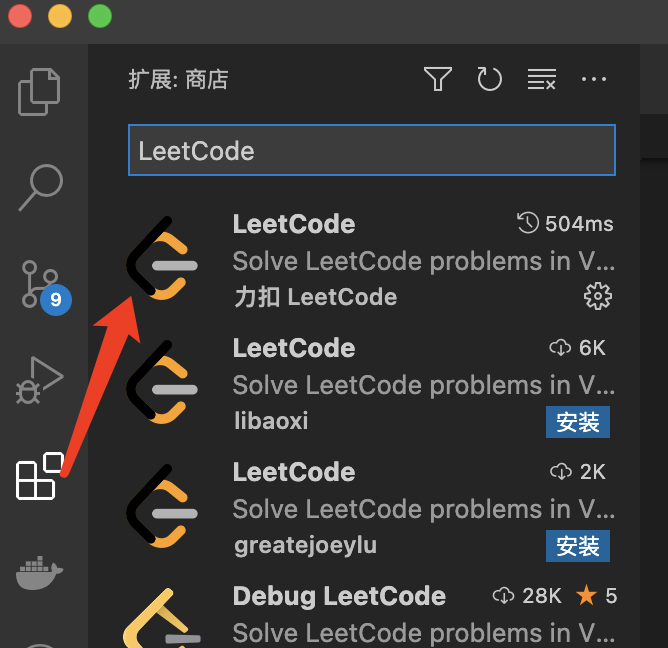
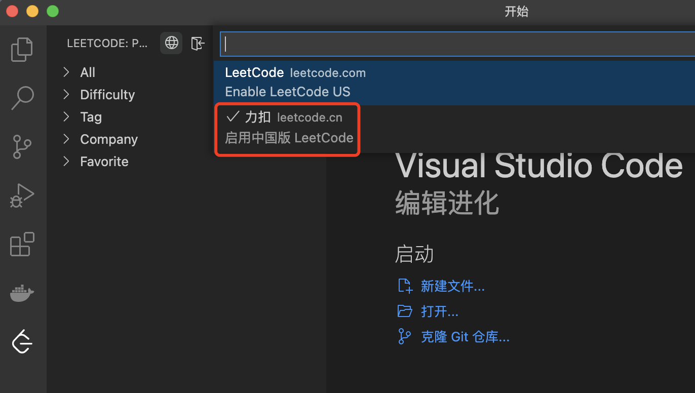
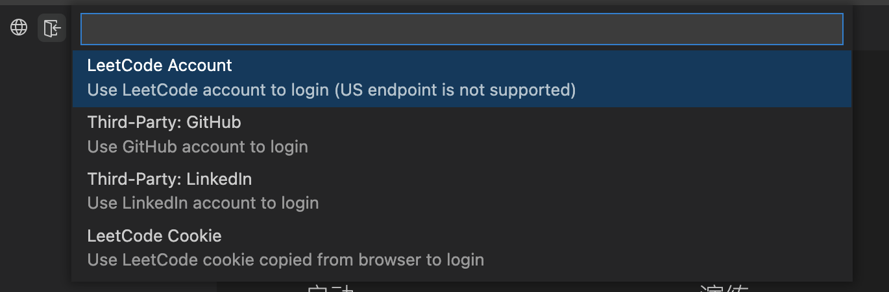
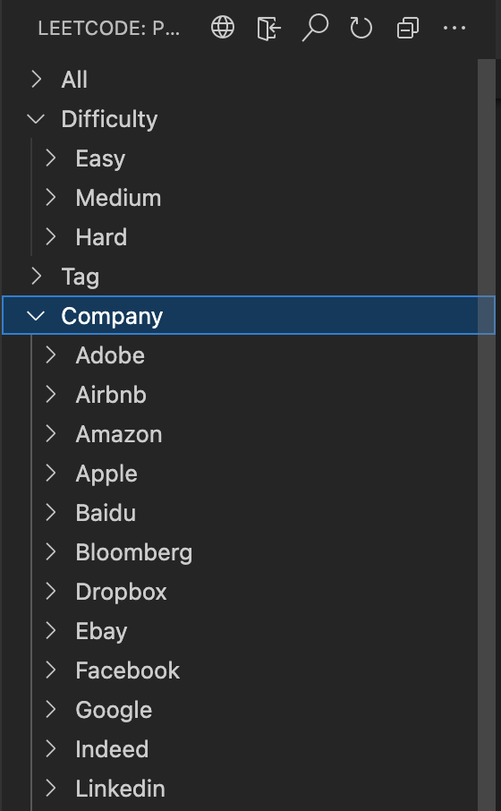
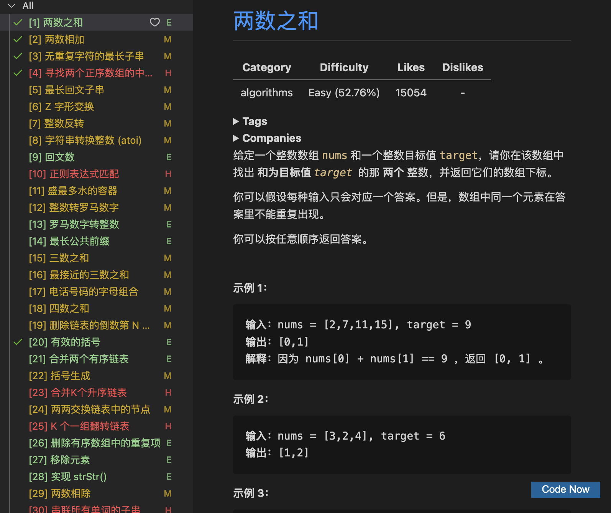
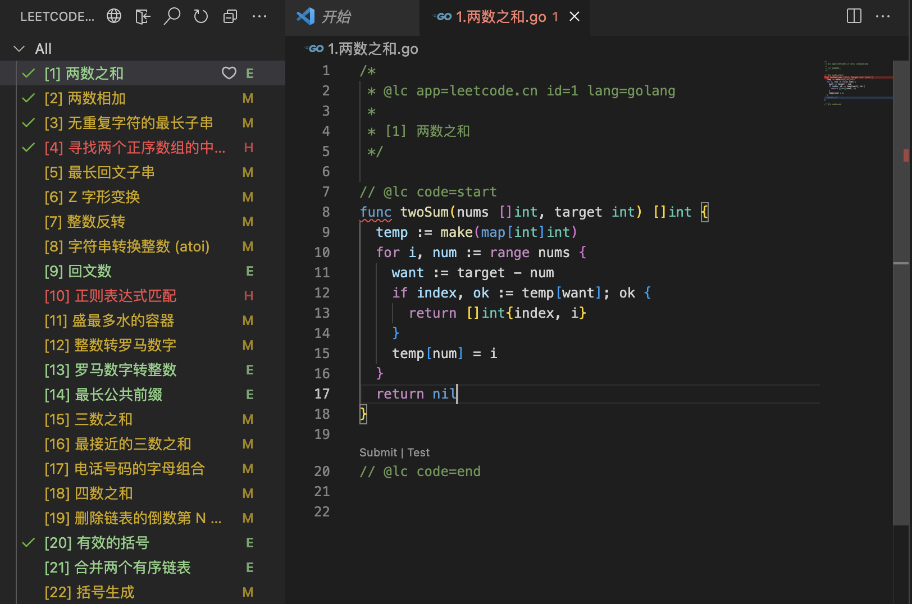
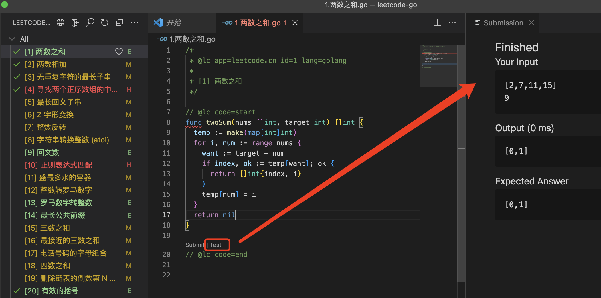
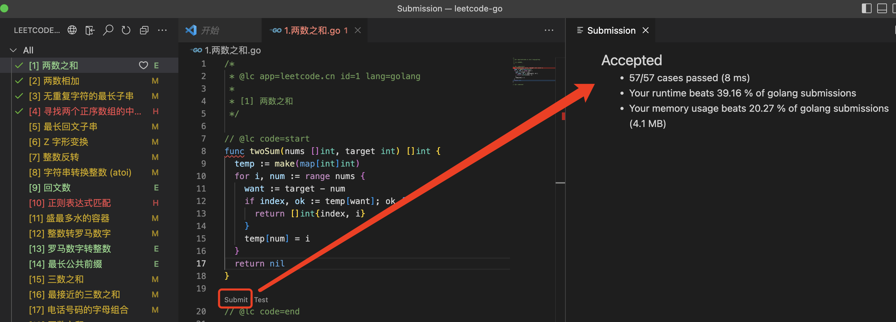

::: tip
vscode这款插件太香了，终于可以沉浸式刷leetcode:smile:
:::

<!-- more -->

## 环境搭建

### 安装
在vscode扩展商店搜索`LeetCode`,一般是下载量最高的那个就完事了


### 登陆
在登陆之前，记得要选择中国版，否则会遇见登陆不上问题

接下来选择账号登录，需要提前在LeetCode官网注册账号

这里我选择账户方式，按照提示填写邮箱、密码即可登录

### 预览


>在左侧，该插件按照五个分类将题目进行了分类，比如：按照难易程度(简单、中等、难)、按照标签(数据、二叉搜索等)、按照公司(Google、Facebook等)
>
>且题目根据难易程度有不同的颜色进行区分，如果已经完成相关的练习，还会用:heavy_check_mark:提示

### 个性化配置
```json
{
  "leetcode.endpoint": "leetcode-cn",
  "leetcode.workspaceFolder": "/Users/hechangjie/code/hexiaopi/leetcode-go",
  "leetcode.defaultLanguage": "golang",
  "leetcode.hint.configWebviewMarkdown": false,
  "leetcode.hint.commentDescription": false,
  "leetcode.hint.commandShortcut": false
}
```

## 沉浸式刷题

### 预览题目内容

点击Code Now，选择一种编程语言就可以开始了

### 编写代码


### 测试代码
点击代码下方的`Test`标签即可进行测试代码（再也不用编写大量的单元测试用例了）


### 提交代码
点击代码下方的`Submit`标签即可提交代码，完成之后就会看到提交后的代码性能等信息了


